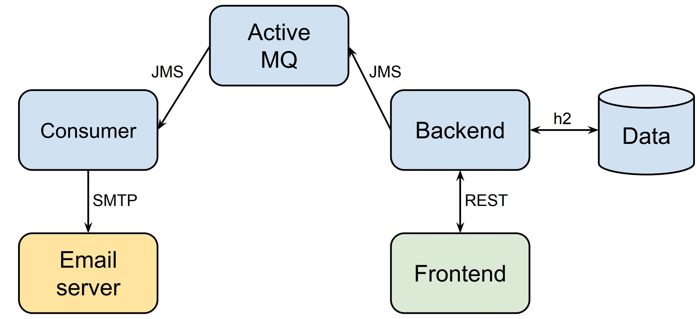

## Intro

Localstack for my trainings



## Running

### Full

```commandline
docker compose up --force-recreate --no-deps --build -d
```

### No Docker Compose

```commandline
./docker-run-all.sh
```

### CI (No Monitoring and Jenkins)

```commandline
docker compose -f docker-compose-ci.yml up -d
```

### Minimal (Only Backend and Frontend)

```commandline
docker compose -f lightweight-docker-compose.yml up -d
```

## Cleanup

```commandline
docker compose down --volumes
```

## Verification

Backend - [http://localhost:4001/swagger-ui/index.html](http://localhost:4001/swagger-ui/index.html)

Frontend - [http://localhost:8081/login](http://localhost:8081/login)

Prometheus - [http://localhost:9090/](http://localhost:9090/)

Grafana - [http://localhost:3000/login](http://localhost:3000/login) (admin/grafana)

Active MQ - [http://localhost:8161](http://localhost:8161/)

Mailhog - [http://localhost:8025/](http://localhost:8025/) 

Jenkins - [http://localhost:8080/](http://localhost:8080/) 

See Container logs for initial Jenkins password.

Email consumer (slow...) - [http://localhost:4002/actuator/prometheus](http://localhost:4002/actuator/prometheus)

## PostgreSQL

The stack includes a PostgreSQL database container named **postgres** running on port **5432**.

### Accessing PostgreSQL Database

You can interact with the PostgreSQL database in several ways:

1. Using docker exec and the psql command-line tool:

```bash
# Connect to the database
docker exec -it postgres psql -U postgres -d testdb

# Common psql commands:
\dt                 # List tables
\d table_name       # Describe table
\q                  # Quit psql

# Example queries:
SELECT * FROM app_user;
SELECT * FROM products;
SELECT * FROM cart_items;
SELECT * FROM orders;
```

2. Using external tools:
   - Host: localhost
   - Port: 5432
   - Database: testdb
   - Username: postgres
   - Password: postgres

### Database Schema

The main tables in the database:
- `app_user`: Stores user information
- `products`: Stores product catalog
- `cart_items`: Stores shopping cart items
- `orders`: Stores order information

## Prometheus & Grafana

[Article](https://stackabuse.com/monitoring-spring-boot-apps-with-micrometer-prometheus-and-grafana/)

## Backend

[https://github.com/slawekradzyminski/test-secure-backend](https://github.com/slawekradzyminski/test-secure-backend)

## Frontend

[https://github.com/slawekradzyminski/test-secure-frontend](https://github.com/slawekradzyminski/test-secure-frontend)

## JMS email consumer

[https://github.com/slawekradzyminski/jms-email-consumer](https://github.com/slawekradzyminski/jms-email-consumer)

## Mailhog

[https://github.com/mailhog/MailHog/tree/master/docs](https://github.com/mailhog/MailHog/tree/master/docs)

## Docker cleanup

```commandline
# Stop and remove all containers
docker stop $(docker ps -a -q) && docker rm $(docker ps -a -q)

# Remove all Docker data (images, containers, volumes, networks)
docker system prune -a --volumes
```

## K6 test execution command

```commandline
K6_INFLUXDB_PUSH_INTERVAL=2s k6 run --out influxdb=http://localhost:8086/db0  dist/user-journey.js
```

## Log into container

```commandline
docker exec -it <container_id> bash
```
