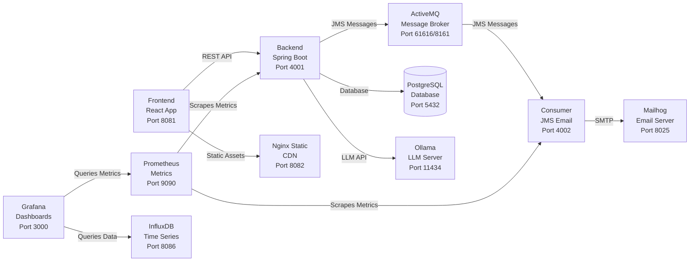

# Awesome LocalStack - Complete Development Environment

A comprehensive Docker-based development environment that provides a full-stack application with monitoring, CI/CD, and AI capabilities for training and development purposes.

## 🏗️ Architecture

The project consists of multiple interconnected services that simulate a production-like environment:



## 🔗 Microservices Architecture

This environment demonstrates a **microservices architecture** where each service is developed as a separate codebase:

### 🏗️ Service Breakdown
- **[Backend API](https://github.com/slawekradzyminski/test-secure-backend)** - Handles business logic, authentication, and data persistence
- **[Frontend App](https://github.com/slawekradzyminski/vite-react-frontend)** - Provides user interface and client-side functionality  
- **[Email Consumer](https://github.com/slawekradzyminski/jms-email-consumer)** - Processes asynchronous email notifications

### 🔄 Communication Flow
1. **User interactions** → Frontend React app
2. **API requests** → Backend Spring Boot service
3. **Async notifications** → ActiveMQ → Email Consumer → Mailhog
4. **Static assets** → Nginx CDN for optimized delivery

### 🎯 Benefits of This Architecture
- **Independent development** - Each team can work on their service
- **Technology diversity** - Different tech stacks per service
- **Scalability** - Services can be scaled independently
- **Fault isolation** - Issues in one service don't affect others

## 🚀 Quick Start

### Full Environment (Recommended)
```bash
docker compose up -d
```

### Alternative Methods

**Using Docker Compose directly:**
```bash
./run-docker-compose.sh
```

**Using individual Docker commands:**
```bash
./docker-run-all.sh
```

**CI Environment (No Monitoring/Jenkins):**
```bash
docker compose -f docker-compose-ci.yml up -d
```

**Minimal Environment (Backend + Frontend only):**
```bash
docker compose -f lightweight-docker-compose.yml up -d
```

## 🧹 Cleanup

```bash
# Stop and remove containers with volumes
docker compose down --volumes

# Complete cleanup (all Docker resources)
./docker-prune.sh
```

## 📊 Services & Endpoints

| Service | URL | Description | Credentials |
|---------|-----|-------------|-------------|
| **Backend API** | [http://localhost:4001/swagger-ui/index.html](http://localhost:4001/swagger-ui/index.html) | Spring Boot REST API with Swagger docs ([source](https://github.com/slawekradzyminski/test-secure-backend)) | - |
| **Frontend** | [http://localhost:8081/login](http://localhost:8081/login) | React application ([source](https://github.com/slawekradzyminski/vite-react-frontend)) | - |
| **Prometheus** | [http://localhost:9090/](http://localhost:9090/) | Metrics collection and monitoring | - |
| **Grafana** | [http://localhost:3000/login](http://localhost:3000/login) | Dashboards and visualization | `admin/grafana` |
| **ActiveMQ** | [http://localhost:8161](http://localhost:8161/) | Message broker web console | `admin/admin` |
| **Mailhog** | [http://localhost:8025/](http://localhost:8025/) | Email testing interface | - |
| **Nginx CDN** | [http://localhost:8082/images/](http://localhost:8082/images/) | Static asset delivery | - |
| **Email Consumer** | [http://localhost:4002/actuator/prometheus](http://localhost:4002/actuator/prometheus) | JMS email processing service ([source](https://github.com/slawekradzyminski/jms-email-consumer)) | - |
| **Ollama LLM** | [http://localhost:11434/api/tags](http://localhost:11434/api/tags) | Local AI model server | - |

## 🗄️ Database

### PostgreSQL Configuration
- **Host:** localhost
- **Port:** 5432
- **Database:** testdb
- **Username:** postgres
- **Password:** postgres

### Database Access

**Using Docker:**
```bash
# Connect to database
docker exec -it postgres psql -U postgres -d testdb

# Common commands:
\dt                 # List tables
\d table_name       # Describe table structure
\q                  # Quit psql
```

**Using external tools:**
- Use any PostgreSQL client with the credentials above
- Popular options: pgAdmin, DBeaver, DataGrip

### Database Schema
The application uses the following main tables:
- `app_user` - User management
- `products` - Product catalog
- `cart_items` - Shopping cart
- `orders` - Order management

## 📁 Static Assets (CDN)

The Nginx server acts as a CDN for static assets:

- **Port:** 8082
- **Local Directory:** `./images/`
- **Container Path:** `/usr/share/nginx/html/images`
- **Access:** `http://localhost:8082/images/filename.jpg`

**Available Assets:**
- Product images (applewatch.png, cleancode.png, iphone.png, etc.)
- Brand logos (samsung.png, sony.png, mac.png, etc.)

## 📈 Monitoring Stack

### Prometheus
- **Configuration:** `./prometheus/prometheus.yml`
- **Scrape Interval:** 5s for Spring Boot apps, 10s global
- **Targets:** Backend (4001), Consumer (4002)

### Grafana
- **Pre-configured Dashboards:**
  - Spring Boot Application Metrics
  - HTTP Request Monitoring
  - K6 Load Testing Results
- **Data Sources:** Prometheus, InfluxDB
- **Login:** admin/grafana

### InfluxDB
- **Database:** db0
- **Credentials:** admin/admin
- **Purpose:** Time-series data storage for load testing

## 🤖 AI/LLM Integration

### Ollama Server
- **Model:** qwen3-thinking (pre-loaded)
- **API Endpoint:** http://localhost:11434
- **Custom Image:** slawekradzyminski/ollama:qwen3-thinking

**Testing the LLM:**
```bash
curl -X POST http://localhost:11434/api/generate -d '{
  "model": "qwen3:0.6b",
  "prompt": "What is Docker?"
}'
```

## 🔄 Message Queue

### ActiveMQ Artemis
- **JMS Port:** 61616
- **Web Console:** 8161
- **AMQP Port:** 5672
- **Credentials:** admin/admin
- **Features:** Anonymous login enabled, security disabled for development

### Email Consumer
- **Service:** slawekradzyminski/consumer:3.1.1
- **Purpose:** Processes JMS messages and sends emails via SMTP
- **Monitoring:** Exposes Prometheus metrics

## 🚀 CI/CD Pipeline

### Jenkins
- **Custom Image:** Built from local Dockerfile
- **Plugins:** Blue Ocean, Docker Workflow, Docker Plugin
- **Docker Integration:** Full Docker-in-Docker support
- **Ports:** 8080 (web), 50000 (agents)

**Starting Jenkins separately:**
```bash
docker compose -f docker-compose-jenkins.yml up -d
```

## 📧 Email Testing

### Mailhog
- **Web Interface:** http://localhost:8025
- **SMTP Port:** 1025
- **Purpose:** Catches all emails for testing without sending to real addresses

## 🧪 Load Testing

### K6 Integration
```bash
# Run load tests with InfluxDB output
K6_INFLUXDB_PUSH_INTERVAL=2s k6 run --out influxdb=http://localhost:8086/db0 dist/user-journey.js
```

## 🔧 Development Tools

### Container Management
```bash
# Access container shell
docker exec -it <container_name> bash

# View logs
docker logs <container_name>

# Stop specific service
docker compose stop <service_name>
```

### Network
- **Network Name:** my-private-ntwk
- **Type:** Bridge network
- **Purpose:** Isolated communication between services

## 🛠️ Related Projects

This development environment orchestrates services from multiple dedicated repositories:

### 🎯 Core Application Components
- **[Backend API](https://github.com/slawekradzyminski/test-secure-backend)** - Spring Boot REST API with JWT authentication, user management, and e-commerce features
- **[Frontend App](https://github.com/slawekradzyminski/vite-react-frontend)** - React + TypeScript application with modern UI, authentication, and admin dashboard
- **[Email Consumer](https://github.com/slawekradzyminski/jms-email-consumer)** - JMS message processor that handles email notifications via ActiveMQ

### 🔗 Service Integration
Each component is designed to work seamlessly together:
- **Backend** exposes REST APIs consumed by the **Frontend**
- **Backend** publishes JMS messages to **ActiveMQ** 
- **Email Consumer** processes messages and sends emails via **Mailhog**
- **Frontend** serves static assets through **Nginx CDN**

### 🛠️ Development Workflow
- Clone individual repositories for focused development
- Use this orchestration project for full-stack testing
- Each service can be developed independently with Docker containers

## 🛠️ Environment Configurations

### Full Stack (`docker-compose.yml`)
- All services including monitoring, CI/CD, and AI
- Persistent volumes for data storage
- Complete development environment

### CI Environment (`docker-compose-ci.yml`)
- Core application services only
- No monitoring or Jenkins
- Suitable for CI/CD pipelines

### Lightweight (`lightweight-docker-compose.yml`)
- Backend and Frontend only
- Minimal resource usage
- Quick development setup

### Jenkins Only (`docker-compose-jenkins.yml`)
- Standalone Jenkins with Docker support
- Custom image with pre-installed plugins

### LLM Only (`docker-compose-llm.yml`)
- Ollama server with persistent model storage
- Independent AI development environment

## 🔍 Troubleshooting

### Common Issues
1. **Port conflicts:** Ensure ports are not used by other services
2. **Container startup order:** Services have proper dependencies configured
3. **Volume permissions:** Docker volumes are created automatically
4. **Network connectivity:** All services use the same bridge network

### Logs and Debugging
```bash
# View all container logs
docker compose logs

# View specific service logs
docker compose logs backend

# Follow logs in real-time
docker compose logs -f
```

## 📄 License

This project is designed for training and development purposes. All external services and images maintain their respective licenses.
