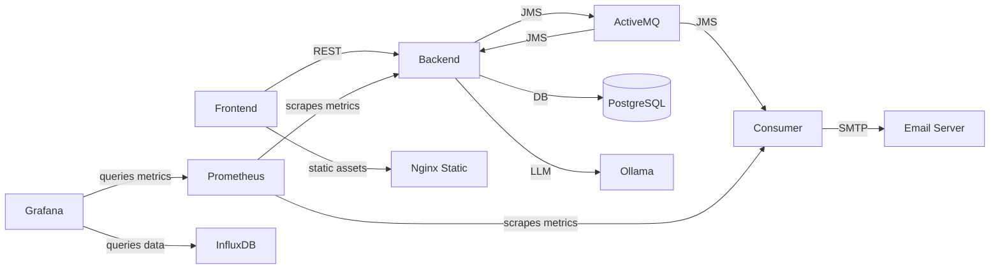

## Intro

Localstack for my trainings

# Architecture

Here's an example of a Mermaid diagram that shows the different components in this project and how they interact:




## Running

### Full

```commandline
docker compose up --force-recreate --no-deps --build -d
```

### No Docker Compose

```commandline
./docker-run-all.sh
```

### CI (No Monitoring and Jenkins)

```commandline
docker compose -f docker-compose-ci.yml up -d
```

### Minimal (Only Backend and Frontend)

```commandline
docker compose -f lightweight-docker-compose.yml up -d
```

## Cleanup

```commandline
docker compose down --volumes
```

## Verification

Backend - [http://localhost:4001/swagger-ui/index.html](http://localhost:4001/swagger-ui/index.html)

Frontend - [http://localhost:8081/login](http://localhost:8081/login)

Prometheus - [http://localhost:9090/](http://localhost:9090/)

Grafana - [http://localhost:3000/login](http://localhost:3000/login) (admin/grafana)

Active MQ - [http://localhost:8161](http://localhost:8161/)

Mailhog - [http://localhost:8025/](http://localhost:8025/) 

Jenkins - [http://localhost:8080/](http://localhost:8080/) 

Nginx Static (CDN) - [http://localhost:8082/images/](http://localhost:8082/images/)

See Container logs for initial Jenkins password.

Email consumer (slow...) - [http://localhost:4002/actuator/prometheus](http://localhost:4002/actuator/prometheus)

Ollama - [http://localhost:11434/api/tags](http://localhost:11434/api/tags)

## PostgreSQL

The stack includes a PostgreSQL database container named **postgres** running on port **5432**.

### Accessing PostgreSQL Database

You can interact with the PostgreSQL database in several ways:

1. Using docker exec and the psql command-line tool:

```bash
# Connect to the database
docker exec -it postgres psql -U postgres -d testdb

# Common psql commands:
\dt                 # List tables
\d table_name       # Describe table
\q                  # Quit psql

# Example queries:
SELECT * FROM app_user;
SELECT * FROM products;
SELECT * FROM cart_items;
SELECT * FROM orders;
```

2. Using external tools:
   - Host: localhost
   - Port: 5432
   - Database: testdb
   - Username: postgres
   - Password: postgres

### Database Schema

The main tables in the database:
- `app_user`: Stores user information
- `products`: Stores product catalog
- `cart_items`: Stores shopping cart items
- `orders`: Stores order information

## Nginx Static (CDN)

The stack includes an Nginx server that acts as a CDN equivalent for serving static assets:

- **Port:** 8082
- **Purpose:** Efficiently serves static files like images, CSS, and JavaScript
- **Configuration:** 
  - Mounts the local `./images` directory to `/usr/share/nginx/html/images` in the container
  - Accessible at [http://localhost:8082/images/](http://localhost:8082/images/)

### Usage

1. Place your static assets in the `./images` directory in the project root
2. Access them via `http://localhost:8082/images/your-file.jpg`
3. Reference these assets in your application for improved performance and separation of concerns

This setup allows you to offload static content delivery from your application servers, improving performance and scalability.

## Prometheus & Grafana

[Article](https://stackabuse.com/monitoring-spring-boot-apps-with-micrometer-prometheus-and-grafana/)

## Backend

https://github.com/slawekradzyminski/test-secure-backend

## Frontend

https://github.com/slawekradzyminski/vite-react-frontend
## JMS email consumer

https://github.com/slawekradzyminski/jms-email-consumer

## Mailhog

https://github.com/mailhog/MailHog/tree/master/docs

## Docker cleanup

```commandline
# Stop and remove all containers
docker stop $(docker ps -a -q) && docker rm $(docker ps -a -q)

# Remove all Docker data (images, containers, volumes, networks)
docker system prune -a --volumes
```

## K6 test execution command

```commandline
K6_INFLUXDB_PUSH_INTERVAL=2s k6 run --out influxdb=http://localhost:8086/db0  dist/user-journey.js
```

## Log into container

```commandline
docker exec -it <container_id> bash
```

# Docker Services Documentation (AI-generated)

## Overview
This project uses Docker Compose to orchestrate multiple environments including CI services and additional applications.

### Additional Applications

#### Jenkins
- **File:** `docker-compose-jenkins.yml`
- **Description:**  
  Builds a Jenkins container from the local Dockerfile with the following configuration:
  - **Ports:**  
    - `8080`: Jenkins web interface  
    - `50000`: Agent communication
  - **Volumes:**  
    - `jenkins-data` persists Jenkins home data  
    - Mounts `/var/run/docker.sock` to allow Docker operations inside Jenkins
- **Starting Jenkins:**
  ```bash
  docker-compose -f docker-compose-jenkins.yml up -d
  ```

#### Ollama Server
- **File:** `docker-compose-llm.yml`
- **Description:**  
  Runs the Ollama server using the official image `ollama/ollama:latest` with the following setup:
  - **Port:**  
    - Exposes `11434` for API access
  - **Volumes:**  
    - `ollama-data` is mounted to persist server data at `/root/.ollama`
  - **Environment:**  
    - `OLLAMA_MODELS_DIR` is set to `/root/.ollama`
- **Starting Ollama:**
  ```bash
  docker-compose -f docker-compose-llm.yml up -d
  ```
- **Testing the Ollama Server:**
  Copy and paste the command below to test the server:
  ```bash
  curl -X POST http://localhost:11434/api/generate -d '{
    "model": "llama3.2:1b",
    "prompt": "What is Docker?"
  }'
  ```

## Ollama

[Ollama](https://ollama.ai/) is included as a local LLM server that can be used by the backend for AI-related tasks. The server runs on port 11434 and comes with health checks to ensure model availability.

To test the Ollama server:
```bash
curl -X POST http://localhost:11434/api/generate -d '{
  "model": "llama3.2:1b",
  "prompt": "What is Docker?"
}'
```

## Final Notes
- Verify that the exposed ports are free and not used by other services.
- Use the corresponding docker-compose file per service needs.
- For removing unused Docker objects—if needed—consult and run the `docker-prune.sh` script.
