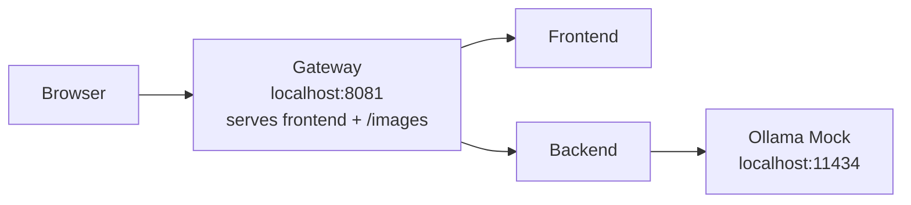
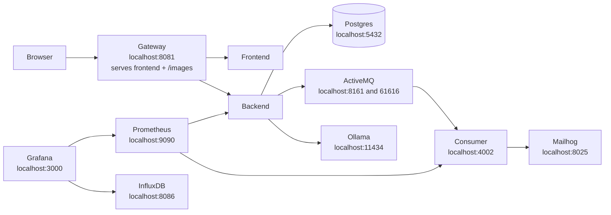
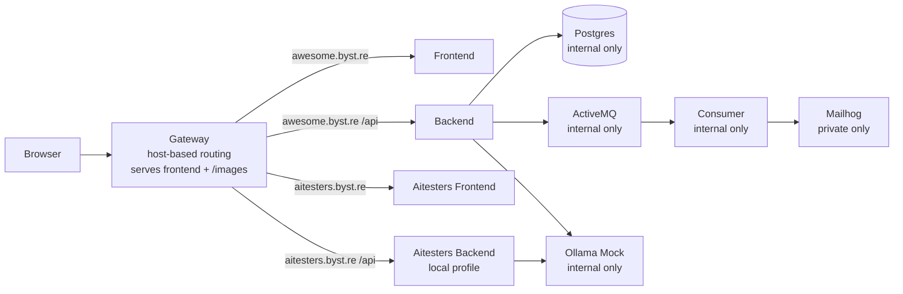

# Awesome LocalStack

Docker orchestration for the training stack built from separate backend, frontend, and consumer repositories.

This README is organized by the three main profiles:

- lightweight
- full
- server

For the detailed published-port matrix, see [docs/PROFILE_URLS.md](docs/PROFILE_URLS.md).

For classroom or workshop use focused on the lightweight stack, see [docs/STUDENT_GUIDE.md](docs/STUDENT_GUIDE.md).

For the local SSO flow, standard-login comparison, and local credentials, see [docs/SSO_FLOW.md](docs/SSO_FLOW.md).

Each main compose file now has its own fixed Compose project name. That means switching between `lightweight`, `full`, and `server` should no longer produce normal orphan warnings just because the profiles define different services.

This does not mean the profiles can run side by side on the same machine. `lightweight` and `full` still publish overlapping host ports such as `8081` and `11434`, so stop one profile before starting the other.

## Lightweight Profile

Use this most of the time for local work.

Start it with:

```bash
docker compose -f lightweight-docker-compose.yml up -d
```

Main app URL:

- `http://localhost:8081/login`

Other useful lightweight URLs:

- Swagger UI: `http://localhost:8081/swagger-ui/index.html`
- OpenAPI JSON: `http://localhost:8081/v3/api-docs`
- image through gateway: `http://localhost:8081/images/iphone.png`
- Keycloak realm: `http://localhost:8082/realms/awesome-testing/.well-known/openid-configuration`
- mocked LLM generate endpoint: `http://localhost:11434/api/generate`

The lightweight profile also starts Keycloak with the `awesome-testing` realm and these training users:

- `sso-client` / `SsoClient123!`
- `sso-admin` / `SsoAdmin123!`

Password-login demo users are still available through the application login:

- `admin` / `LocalDemoAdmin123!`
- `client` / `client`
- `client2` / `client2`
- `client3` / `client3`

Keycloak Admin Console is available at `http://localhost:8082/admin/` with `admin` / `admin`.
The local realm enables browser Authorization Code + PKCE for the frontend and direct access grants for Playwright training fixtures. Direct grants are included only so tests can obtain an ID token over HTTP, exchange it through the backend, and start UI tests already authenticated with app-issued tokens.

Architecture:


```mermaid
flowchart LR
    U[Browser]
    G[Gateway<br/>localhost:8081<br/>serves frontend + /images]
    F[Frontend]
    B[Backend]
    O[Ollama Mock<br/>localhost:11434]

    U --> G
    G --> F
    G --> B
    B --> O
```

What students should verify:

```bash
docker compose -f lightweight-docker-compose.yml ps
curl -i http://localhost:8081/login
curl -i http://localhost:8081/v3/api-docs
curl -i http://localhost:8081/images/iphone.png
curl -i -X POST http://localhost:11434/api/generate \
  -H 'Content-Type: application/json' \
  -d '{"model":"qwen3.5:2b","prompt":"hello"}'
```

Expected:

- all lightweight containers are `Up`
- login page loads
- Swagger and OpenAPI respond with `200`
- product image responds with `200`
- the mocked model path responds with the same `qwen3.5:2b` default used across the migration
- mocked LLM generate endpoint responds with `200`

Useful logs:

```bash
docker compose -f lightweight-docker-compose.yml logs -f backend gateway
docker compose -f lightweight-docker-compose.yml logs -f ollama-mock
```

Stop it with:

```bash
docker compose -f lightweight-docker-compose.yml down
```

## Full Profile

Use this when you want the local app plus monitoring, DB, queueing, email testing, consumer, and real Ollama.

Start it with:

```bash
docker compose -f docker-compose.yml up -d
```

This local full stack intentionally starts the backend with `docker,demo`, so PostgreSQL-backed demo users, products, and sample orders are available with the same seeded admin credentials as the lightweight profile.

Main app URL:

- `http://localhost:8081/login`

Other useful full-profile URLs:

- Swagger UI: `http://localhost:8081/swagger-ui/index.html`
- OpenAPI JSON: `http://localhost:8081/v3/api-docs`
- Prometheus: `http://localhost:9090/graph`
- Grafana: `http://localhost:3000/login`
- ActiveMQ console: `http://localhost:8161`
- Mailhog UI: `http://localhost:8025/`
- Keycloak realm: `http://localhost:8082/realms/awesome-testing/.well-known/openid-configuration`
- Keycloak Admin Console: `http://localhost:8082/admin/` (`admin` / `admin`)
- consumer metrics: `http://localhost:4002/actuator/prometheus`
- Ollama: `http://localhost:11434/api/tags`
- Postgres: `localhost:5432`

If you need to refresh seeded PostgreSQL demo data after fixture or credential changes:

```bash
docker compose -f docker-compose.yml down -v
docker compose -f docker-compose.yml up -d
```

The Ollama container in this profile is expected to expose `qwen3.5:2b` from the published `ollama-qwen35-2b` image.

SSO is enabled in the local `lightweight`, `full`, and `ci` compose profiles. Those profiles all start Keycloak and configure the backend with the local issuer and JWK endpoint. The `server` profile should not use this local training realm by default; production/server SSO needs a real issuer, real redirect URLs, and managed credentials configured deliberately for that deployment.

See [docs/SSO_FLOW.md](docs/SSO_FLOW.md) for the detailed browser redirect flow, backend exchange flow, and the difference between application password login and SSO login.

Architecture:


```mermaid
flowchart LR
    U[Browser]
    G[Gateway<br/>localhost:8081<br/>serves frontend + /images]
    F[Frontend]
    B[Backend]
    DB[(Postgres<br/>localhost:5432)]
    MQ[ActiveMQ<br/>localhost:8161 and 61616]
    C[Consumer<br/>localhost:4002]
    M[Mailhog<br/>localhost:8025]
    O[Ollama<br/>localhost:11434]
    P[Prometheus<br/>localhost:9090]
    GR[Grafana<br/>localhost:3000]
    I[InfluxDB<br/>localhost:8086]

    U --> G
    G --> F
    G --> B
    B --> DB
    B --> MQ
    MQ --> C
    C --> M
    B --> O
    P --> B
    P --> C
    GR --> P
    GR --> I
```

Quick verification:

```bash
./run-docker-compose.sh
```

That script waits for the main local services and endpoints to come up.

If you ever need to force cleanup after interrupted local runs, `--remove-orphans` remains a fallback, but it should no longer be part of normal profile switching.

Database access:

- host: `localhost`
- port: `5432`
- database: `testdb`
- user: `postgres`
- password: `postgres`

Connect with Docker:

```bash
docker exec -it postgres psql -U postgres -d testdb
```

Useful logs:

```bash
docker compose -f docker-compose.yml logs -f backend
docker compose -f docker-compose.yml logs -f gateway
docker compose -f docker-compose.yml logs -f consumer
```

Stop it with:

```bash
docker compose -f docker-compose.yml down
```

## Server Profile

Use this for the deployed production-like environment.

Server operations:

```bash
make ansible-ssh
make ansible-deploy
make ansible-verify
make ansible-reset-demo-state
make ansible-reset-aitesters-state
```

- `make ansible-ssh`: open a shell on the VPS using the Ansible/Vault connection settings
- `make ansible-deploy`: converge the server stack and run post-deploy verification
- `make ansible-verify`: run health checks without changing deployment state
- `make ansible-reset-demo-state`: destructively reset Postgres and Mailhog-backed demo state, then redeploy
- `make ansible-reset-aitesters-state`: recreate only the H2-backed aitesters backend and reseed local demo data

Main public URLs:

- stable public playground: `https://awesome.byst.re/login`
- disposable API/UI testing sandbox: `https://aitesters.byst.re/login`

Other stable playground URLs:

- Swagger UI: `https://awesome.byst.re/swagger-ui/index.html`
- OpenAPI JSON: `https://awesome.byst.re/v3/api-docs`
- sign in API: `https://awesome.byst.re/api/v1/users/signin`
- image through gateway: `https://awesome.byst.re/images/iphone.png`

Other aitesters sandbox URLs:

- Swagger UI: `https://aitesters.byst.re/swagger-ui/index.html`
- OpenAPI JSON: `https://aitesters.byst.re/v3/api-docs`
- sign in API: `https://aitesters.byst.re/api/v1/users/signin`
- local email outbox: `https://aitesters.byst.re/api/v1/local/email/outbox`
- image through gateway: `https://aitesters.byst.re/images/iphone.png`

For the long-lived domain and routing architecture, see [docs/PROFILE_URLS.md](docs/PROFILE_URLS.md).

Architecture:


```mermaid
flowchart LR
    U[Browser]
    G[Gateway<br/>host-based routing<br/>serves frontend + /images]
    F[Frontend]
    B[Backend]
    AF[Aitesters Frontend]
    AB[Aitesters Backend<br/>local profile]
    DB[(Postgres<br/>internal only)]
    MQ[ActiveMQ<br/>internal only]
    C[Consumer<br/>internal only]
    M[Mailhog<br/>private only]
    O[Ollama Mock<br/>internal only]

    U --> G
    G -->|awesome.byst.re| F
    G -->|awesome.byst.re /api| B
    G -->|aitesters.byst.re| AF
    G -->|aitesters.byst.re /api| AB
    B --> DB
    B --> MQ
    MQ --> C
    C --> M
    B --> O
    AB --> O
```

Production hardening in this profile:

- only the gateway is published on the host
- Postgres is not published
- Mailhog UI is not published
- Mailhog SMTP is not published
- Mailhog API is not published
- ActiveMQ is internal-only
- consumer metrics are internal-only
- aitesters backend and frontend are internal-only behind the same gateway
- images are served directly by the gateway

Quick public verification:

```bash
curl -i https://awesome.byst.re/login
curl -i https://awesome.byst.re/v3/api-docs
curl -i https://awesome.byst.re/images/iphone.png
curl -i https://awesome.byst.re/mailhog/api/v2/messages
curl -i https://aitesters.byst.re/login
curl -i https://aitesters.byst.re/v3/api-docs
curl -i https://aitesters.byst.re/images/iphone.png
curl -i https://aitesters.byst.re/api/v1/local/email/outbox
```

Expected:

- `awesome.byst.re/login` returns `200`
- `awesome.byst.re/v3/api-docs` returns `200`
- `awesome.byst.re/images/iphone.png` returns `200`
- `awesome.byst.re/mailhog/api/v2/messages` returns `404`
- `aitesters.byst.re/login` returns `200`
- `aitesters.byst.re/v3/api-docs` returns `200`
- `aitesters.byst.re/images/iphone.png` returns `200`
- `aitesters.byst.re/api/v1/local/email/outbox` returns `200`

Server operations:

Deployment and server access are managed through Ansible. See [docs/ANSIBLE.md](docs/ANSIBLE.md), [docs/SSH_SERVER.md](docs/SSH_SERVER.md), and [docs/SSH_TUNNELLING.md](docs/SSH_TUNNELLING.md).

Tail backend logs on the server:

```bash
cd /opt/awesome-localstack
docker compose -f docker-compose.server.yml logs --tail=200 -f backend
```

Tail gateway logs:

```bash
cd /opt/awesome-localstack
docker compose -f docker-compose.server.yml logs --tail=200 -f gateway
```

Stop the server stack on the VPS with:

```bash
cd /opt/awesome-localstack
docker compose -f docker-compose.server.yml down
```

## Shared App Routes

Across the main profiles, the gateway serves:

- frontend pages under `/`
- backend API under `/api/v1/...`
- Swagger UI under `/swagger-ui/...`
- OpenAPI under `/v3/api-docs`
- actuator under `/actuator/...`
- traffic WebSocket under `/api/v1/ws-traffic`
- static images under `/images/...`

## Related Projects

- [test-secure-backend](https://github.com/slawekradzyminski/test-secure-backend)
- [vite-react-frontend](https://github.com/slawekradzyminski/vite-react-frontend)
- [jms-email-consumer](https://github.com/slawekradzyminski/jms-email-consumer)

## Troubleshooting

- If the app returns `502`, backend startup is usually still in progress.
- If Swagger generates the wrong host or scheme, inspect `/v3/api-docs` and check `.servers[0].url`.
- If images are missing in the app, check the gateway URL first.
- If nginx config changes do not seem to apply, recreate `gateway`.
