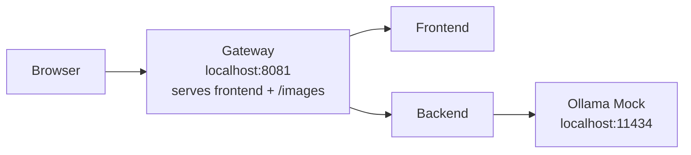
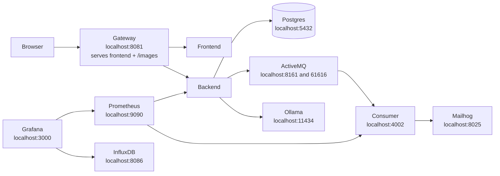
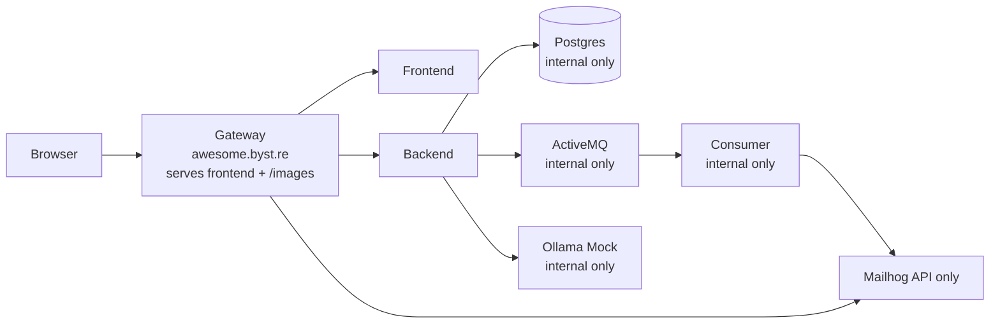

# Awesome LocalStack

Docker orchestration for the training stack built from separate backend, frontend, and consumer repositories.

This README is organized by the three main profiles:

- lightweight
- full
- server

For the detailed published-port matrix, see [PROFILE_URLS.md](/Users/admin/IdeaProjects/awesome-localstack/PROFILE_URLS.md).

For classroom or workshop use focused on the lightweight stack, see [STUDENT_GUIDE.md](/Users/admin/IdeaProjects/awesome-localstack/STUDENT_GUIDE.md).

Each main compose file now has its own fixed Compose project name. That means switching between `lightweight`, `full`, and `server` should no longer produce normal orphan warnings just because the profiles define different services.

This does not mean the profiles can run side by side on the same machine. `lightweight` and `full` still publish overlapping host ports such as `8081` and `11434`, so stop one profile before starting the other.

## Lightweight Profile

Use this most of the time for local work.

Start it with:

```bash
docker compose -f lightweight-docker-compose.yml up -d
```

Main app URL:

- `http://localhost:8081/login`

Other useful lightweight URLs:

- Swagger UI: `http://localhost:8081/swagger-ui/index.html`
- OpenAPI JSON: `http://localhost:8081/v3/api-docs`
- image through gateway: `http://localhost:8081/images/iphone.png`
- mocked LLM generate endpoint: `http://localhost:11434/api/generate`

Architecture:


```mermaid
flowchart LR
    U[Browser]
    G[Gateway<br/>localhost:8081<br/>serves frontend + /images]
    F[Frontend]
    B[Backend]
    O[Ollama Mock<br/>localhost:11434]

    U --> G
    G --> F
    G --> B
    B --> O
```

What students should verify:

```bash
docker compose -f lightweight-docker-compose.yml ps
curl -i http://localhost:8081/login
curl -i http://localhost:8081/v3/api-docs
curl -i http://localhost:8081/images/iphone.png
curl -i -X POST http://localhost:11434/api/generate \
  -H 'Content-Type: application/json' \
  -d '{"model":"qwen3.5:2b","prompt":"hello"}'
```

Expected:

- all lightweight containers are `Up`
- login page loads
- Swagger and OpenAPI respond with `200`
- product image responds with `200`
- the mocked model path responds with the same `qwen3.5:2b` default used across the migration
- mocked LLM generate endpoint responds with `200`

Useful logs:

```bash
docker compose -f lightweight-docker-compose.yml logs -f backend gateway
docker compose -f lightweight-docker-compose.yml logs -f ollama-mock
```

Stop it with:

```bash
docker compose -f lightweight-docker-compose.yml down
```

## Full Profile

Use this when you want the local app plus monitoring, DB, queueing, email testing, consumer, and real Ollama.

Start it with:

```bash
docker compose -f docker-compose.yml up -d
```

Main app URL:

- `http://localhost:8081/login`

Other useful full-profile URLs:

- Swagger UI: `http://localhost:8081/swagger-ui/index.html`
- OpenAPI JSON: `http://localhost:8081/v3/api-docs`
- Prometheus: `http://localhost:9090/graph`
- Grafana: `http://localhost:3000/login`
- ActiveMQ console: `http://localhost:8161`
- Mailhog UI: `http://localhost:8025/`
- consumer metrics: `http://localhost:4002/actuator/prometheus`
- Ollama: `http://localhost:11434/api/tags`
- Postgres: `localhost:5432`

The Ollama container in this profile is expected to expose `qwen3.5:2b` from the published `ollama-qwen35-2b` image.

Architecture:


```mermaid
flowchart LR
    U[Browser]
    G[Gateway<br/>localhost:8081<br/>serves frontend + /images]
    F[Frontend]
    B[Backend]
    DB[(Postgres<br/>localhost:5432)]
    MQ[ActiveMQ<br/>localhost:8161 and 61616]
    C[Consumer<br/>localhost:4002]
    M[Mailhog<br/>localhost:8025]
    O[Ollama<br/>localhost:11434]
    P[Prometheus<br/>localhost:9090]
    GR[Grafana<br/>localhost:3000]
    I[InfluxDB<br/>localhost:8086]

    U --> G
    G --> F
    G --> B
    B --> DB
    B --> MQ
    MQ --> C
    C --> M
    B --> O
    P --> B
    P --> C
    GR --> P
    GR --> I
```

Quick verification:

```bash
./run-docker-compose.sh
```

That script waits for the main local services and endpoints to come up.

If you ever need to force cleanup after interrupted local runs, `--remove-orphans` remains a fallback, but it should no longer be part of normal profile switching.

Database access:

- host: `localhost`
- port: `5432`
- database: `testdb`
- user: `postgres`
- password: `postgres`

Connect with Docker:

```bash
docker exec -it postgres psql -U postgres -d testdb
```

Useful logs:

```bash
docker compose -f docker-compose.yml logs -f backend
docker compose -f docker-compose.yml logs -f gateway
docker compose -f docker-compose.yml logs -f consumer
```

Stop it with:

```bash
docker compose -f docker-compose.yml down
```

## Server Profile

Use this for the deployed production-like environment.

Deploy it with:

```bash
./deploy-server.sh
```

Main public URL:

- `https://awesome.byst.re/login`

Other public server URLs:

- Swagger UI: `https://awesome.byst.re/swagger-ui/index.html`
- OpenAPI JSON: `https://awesome.byst.re/v3/api-docs`
- sign in API: `https://awesome.byst.re/api/v1/users/signin`
- image through gateway: `https://awesome.byst.re/images/iphone.png`
- Mailhog API: `https://awesome.byst.re/mailhog/api/v2/messages`

Architecture:


```mermaid
flowchart LR
    U[Browser]
    G[Gateway<br/>awesome.byst.re<br/>serves frontend + /images]
    F[Frontend]
    B[Backend]
    MH[Mailhog API only]
    DB[(Postgres<br/>internal only)]
    MQ[ActiveMQ<br/>internal only]
    C[Consumer<br/>internal only]
    O[Ollama Mock<br/>internal only]

    U --> G
    G --> F
    G --> B
    G --> MH
    B --> DB
    B --> MQ
    MQ --> C
    C --> MH
    B --> O
```

Production hardening in this profile:

- only the gateway is published on the host
- Postgres is not published
- Mailhog UI is not published
- Mailhog SMTP is not published
- ActiveMQ is internal-only
- consumer metrics are internal-only
- images are served directly by the gateway

Quick public verification:

```bash
curl -i https://awesome.byst.re/login
curl -i https://awesome.byst.re/v3/api-docs
curl -i https://awesome.byst.re/images/iphone.png
curl -i https://awesome.byst.re/mailhog/api/v2/messages
```

Server operations:

Connection details are read from `.env`. See [SSH_SERVER.md](/Users/admin/IdeaProjects/awesome-localstack/SSH_SERVER.md).

Tail backend logs on the server:

```bash
cd /opt/awesome-localstack
docker compose -f docker-compose.server.yml logs --tail=200 -f backend
```

Tail gateway logs:

```bash
cd /opt/awesome-localstack
docker compose -f docker-compose.server.yml logs --tail=200 -f gateway
```

Stop the server stack on the VPS with:

```bash
cd /opt/awesome-localstack
docker compose -f docker-compose.server.yml down
```

## Shared App Routes

Across the main profiles, the gateway serves:

- frontend pages under `/`
- backend API under `/api/v1/...`
- Swagger UI under `/swagger-ui/...`
- OpenAPI under `/v3/api-docs`
- actuator under `/actuator/...`
- traffic WebSocket under `/api/v1/ws-traffic`
- static images under `/images/...`

## Related Projects

- [test-secure-backend](https://github.com/slawekradzyminski/test-secure-backend)
- [vite-react-frontend](https://github.com/slawekradzyminski/vite-react-frontend)
- [jms-email-consumer](https://github.com/slawekradzyminski/jms-email-consumer)

## Troubleshooting

- If the app returns `502`, backend startup is usually still in progress.
- If Swagger generates the wrong host or scheme, inspect `/v3/api-docs` and check `.servers[0].url`.
- If images are missing in the app, check the gateway URL first.
- If nginx config changes do not seem to apply, recreate `gateway`.
