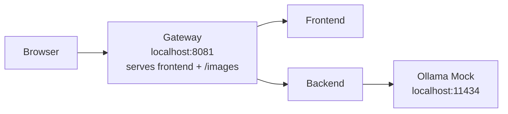

# Student Guide: Lightweight Profile

This guide is for the profile you will use most often:

- `lightweight-docker-compose.yml`

Its goal is to give you a fast local environment with:

- frontend
- backend
- gateway
- static images served by the gateway
- mocked LLM

The lightweight profile still uses `ollama-mock`; the coordinated mock refresh will make `qwen3.5:2b` the expected request model there as well.

## Main Idea

Treat this as a single local web app served through one URL:

- `http://localhost:8081`

Use that URL for:

- frontend pages
- backend API
- Swagger UI
- OpenAPI docs
- product images

Do not think in terms of “frontend on one port and backend on another port” for normal usage. The gateway on `8081` is the intended entrypoint.

## Lightweight Architecture



## Start The Profile

From the `awesome-localstack` directory run:

```bash
docker compose -f lightweight-docker-compose.yml up -d
```

This profile has its own Compose project name, so switching from the full profile should normally work without orphan warnings.

Still, do not run the full profile and the lightweight profile at the same time. They use the same local ports.

## Check That Containers Started

Run:

```bash
docker compose -f lightweight-docker-compose.yml ps
```

Expected services:

- `backend`
- `frontend`
- `gateway`
- `ollama-mock`

Expected status:

- all should be `Up`

## URLs You Should Know

Main application URL:

- `http://localhost:8081/login`

Useful lightweight URLs:

- frontend login: `http://localhost:8081/login`
- Swagger UI: `http://localhost:8081/swagger-ui/index.html`
- OpenAPI JSON: `http://localhost:8081/v3/api-docs`
- sample image through gateway: `http://localhost:8081/images/iphone.png`
- mocked LLM generate endpoint: `http://localhost:11434/api/generate`

For everyday work, prefer `8081`.

## Verification Checklist

Follow these checks in order.

### 1. Frontend Loads

Open:

- `http://localhost:8081/login`

Expected:

- the login page loads
- styling is present
- images load

### 2. Swagger Loads

Open:

- `http://localhost:8081/swagger-ui/index.html`

Expected:

- Swagger UI loads
- API endpoints are listed under `/api/v1/...`

Important:

- Swagger requests should go to `http://localhost:8081/...`

### 3. OpenAPI Docs Respond

Run:

```bash
curl -i http://localhost:8081/v3/api-docs
```

Expected:

- HTTP `200`

### 4. Product Images Work

Run:

```bash
curl -i http://localhost:8081/images/iphone.png
```

Expected:

- HTTP `200`

### 5. Mocked LLM Responds

Run:

```bash
curl -i -X POST http://localhost:11434/api/generate \
  -H 'Content-Type: application/json' \
  -d '{"model":"qwen3.5:2b","prompt":"hello"}'
```

Expected:

- HTTP `200`

## Minimal Smoke Test

If you want one short sequence:

```bash
docker compose -f lightweight-docker-compose.yml up -d
docker compose -f lightweight-docker-compose.yml ps
curl -i http://localhost:8081/login
curl -i http://localhost:8081/v3/api-docs
curl -i http://localhost:8081/images/iphone.png
curl -i -X POST http://localhost:11434/api/generate \
  -H 'Content-Type: application/json' \
  -d '{"model":"qwen3.5:2b","prompt":"hello"}'
```

## How To Read Failures

### `502 Bad Gateway`

Usually means:

- backend is still starting
- lightweight backend startup can take around 30 to 60 seconds

What to do:

```bash
docker compose -f lightweight-docker-compose.yml logs -f backend gateway
```

### Login Page Loads But Images Are Missing

Usually means one of these:

- gateway is still starting
- you are testing the wrong URL
- browser cache is stale after changes

What to check:

```bash
docker compose -f lightweight-docker-compose.yml ps
curl -i http://localhost:8081/images/iphone.png
```

### Swagger Loads But “Try it out” Fails

Usually means:

- backend is still starting
- Swagger is pointing to the wrong host

What to check:

```bash
curl -i http://localhost:8081/v3/api-docs
```

Swagger should use `http://localhost:8081`, not `http://localhost:4001` and not `http://localhost`.

### Mocked LLM Is Not Responding

What to check:

```bash
docker compose -f lightweight-docker-compose.yml ps
curl -i -X POST http://localhost:11434/api/generate \
  -H 'Content-Type: application/json' \
  -d '{"model":"qwen3.5:2b","prompt":"hello"}'
docker compose -f lightweight-docker-compose.yml logs -f ollama-mock
```

### You Switched Profiles And Docker Still Looks Confused

Usually this means:

- a previous Compose run was interrupted

Fallback cleanup:

```bash
docker compose -f lightweight-docker-compose.yml down --remove-orphans
docker compose -f lightweight-docker-compose.yml up -d
```

## Useful Log Commands

Backend and gateway:

```bash
docker compose -f lightweight-docker-compose.yml logs -f backend gateway
```

All lightweight services:

```bash
docker compose -f lightweight-docker-compose.yml logs -f
```

Mocked LLM only:

```bash
docker compose -f lightweight-docker-compose.yml logs -f ollama-mock
```

## Stop The Profile

```bash
docker compose -f lightweight-docker-compose.yml down
```

If you also want to remove volumes created by the profile:

```bash
docker compose -f lightweight-docker-compose.yml down --volumes
```
