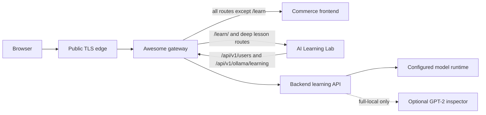

# AI Learning Lab release runbook

This document defines the production contract for serving the standalone AI Learning Lab through Awesome LocalStack. Curriculum content belongs only to the `ai-learning-lab` repository. This repository owns service orchestration, gateway routing, deployment verification, and rollback.

## Release architecture



The browser keeps one origin. `/learn` returns a relative permanent redirect to `/learn/`; `/learn/` and every deep course route are proxied to the Lab container. API requests made by the Lab still use `/api/v1/...` and therefore reach the normal backend through the same gateway. The Lab container is not published directly on the host.

The gateway waits for the backend and AI Lab health checks before starting where those images provide health information. This removes the avoidable Lab `502` window, but deployment verification must still retry because the remaining application services become ready asynchronously.

## Profile behavior

| Profile | Lab artifact | Model behavior | GPT-2 inspector | Intended use |
| --- | --- | --- | --- | --- |
| `lightweight` | pulled `AI_LAB_IMAGE` | `ollama-mock`; deterministic legacy demos only | no | quick local app and course-shell work |
| `lightweight` + `docker-compose.ai-lab-build.yml` | built from sibling checkout | same lightweight mock | no | cross-repository frontend work |
| `full` | pulled `AI_LAB_IMAGE` | Bonsai through Docker Model Runner adapter | no | normal full stack on the author's Mac |
| `full` + `docker-compose.ai-lab-local.yml` | built from sibling checkout | Bonsai through adapter | yes, private and cached | model-internals teaching and development |
| `server` | pulled immutable Lab image | production `ollama-mock` | no | public deployment |
| CI + `docker-compose.ai-lab-ci.yml` | deterministic nginx fixture | CI model mock | no | orchestration, readiness, and gateway routing only |

The CI fixture is deliberately not the application. The AI Lab repository must run the real unit, build, course-browser, and Docker-image tests. LocalStack CI uses the fixture so a branch does not fail merely because its not-yet-released Lab tag is absent from the registry.

The AI Lab build defaults to guided-only mode. Only `docker-compose.ai-lab-local.yml` passes the build argument `VITE_AI_LIVE_RUNTIME_ENABLED=true`, because that profile also supplies the real Docker Model Runner adapter and the private GPT-2 inspector. Lightweight, server, CI, and the cross-repository E2E build intentionally omit the argument and must stay guided-only. `scripts/verify-ai-lab-config.sh` enforces this profile boundary.

The full-local model set currently contains Bonsai but no dedicated semantic-embedding model. Next-token probabilities, token counting, and GPT-2 inspection are verified live. The semantic-embedding control intentionally displays its unavailable error state until an embedding model is installed; the guided embedding exercise remains fully usable. This is a local capability limitation, not a production regression.

## Production model capability boundary

`slawekradzyminski/ollama-mock:1.0.5` supports the existing deterministic `/api/generate` scenarios. Direct verification of that image shows that it does not implement the learning-model contract:

- a request with `logprobs: true` returns an ordinary canned generation without log probabilities;
- `/api/embed` returns `404`;
- `/api/tags` returns `404`.

Consequently, production serves the complete guided course shell, diagrams, mathematics, exercises, and recorded deep links with live runtime controls disabled at build time. Before a live-model control is exposed in production, one of these contracts must be selected and tested:

1. extend and version the mock with deterministic learning responses that match the backend DTOs; or
2. expose a production model runtime that supports the required operations; or
3. have the frontend capability-check the learning API and clearly show the static fallback/unavailable state.

The legacy `LLM` navigation entry should remain for now. It exercises existing generate/chat/tool demonstrations for which the mock was designed. Hiding the whole entry would remove working recorded functionality without solving the distinct learning-endpoint gap. If the primary frontend later conditionally hides individual live controls, the condition must come from a backend capability response rather than hostname detection.

## Immutable image and version strategy

Every production release selects a five-image first-party compatibility set, even when only one image changed. Application repositories own image publication; Awesome LocalStack owns the reviewed combination. The current standalone Lab release uses:

| Component | Immutable release reference |
| --- | --- |
| backend | `slawekradzyminski/backend:3.7.10@sha256:2706213591b4cd94fcbb6f295ace9c5da6c55acca08fd2f7c63666803c6e9cd9` |
| primary frontend | `slawekradzyminski/frontend:3.7.7@sha256:a2a6f65f8c94aba11e071374bc325533c746757bd6ad6bbe0924e19e93c21627` |
| AI Lab | `slawekradzyminski/ai-learning-lab:0.1.0@sha256:b11d8a77e11b207f77d7cd9b506635f647cb3951d7eeb97ca5dafddce86b22dc` |
| JMS consumer | `slawekradzyminski/consumer:3.3.3@sha256:60d6dc40846c2437392c953d89c71bcd7fa5c63729bae9d887cc0501fac4d55f` |
| Ollama mock | `slawekradzyminski/ollama-mock:1.0.5@sha256:2a1af2cbe85a838a6ce1febe00cac8f8bd63cc73f367468dc8c82772f2038e89` |

These are registry-published multi-platform manifests. Do not deploy `latest`, a local-only tag, or a tag before its manifest can be pulled on the server architecture. A later release must replace the complete compatibility set intentionally and record its new digests.

The two server frontend services are intentionally released independently:

- update `frontend` when enabling `/learn/` on `awesome.byst.re`;
- leave `aitesters-frontend` on its current known-good image until the aitesters hostname intentionally routes `/learn/` or that build hides the link there.

Updating both to the same new image today would expose an AI Lab link on `aitesters.byst.re`, where `/learn/` currently falls through to the aitesters SPA instead of the Lab. A later release may enable the route on both hosts, but it must be an explicit routing and test decision.

Before changing Compose references, verify each artifact:

```bash
docker buildx imagetools inspect slawekradzyminski/ai-learning-lab:<release-tag>
docker buildx imagetools inspect slawekradzyminski/frontend:<release-tag>
docker buildx imagetools inspect slawekradzyminski/backend:<release-tag>
docker buildx imagetools inspect slawekradzyminski/consumer:<release-tag>
docker buildx imagetools inspect slawekradzyminski/ollama-mock:<release-tag>
```

Run `python3 scripts/verify-release-images.py --remote` to check the complete reviewed set. The general repository-owned publishing contract is documented in [CONTAINER_RELEASES.md](CONTAINER_RELEASES.md).

Record the selected tags, digests, Git commits, and course-test run in the release or pull-request description. The Compose file remains the reviewable source of the production compatibility set; `AI_LAB_IMAGE` is useful for candidate smoke tests, but production should converge to the reviewed immutable reference.

## Recorded-course compatibility gate

The existing AI Lab course browser suite is the release contract for already-recorded videos. Do not edit assertions merely to make a new implementation pass. A candidate is releasable only when:

- the AI Lab unit suite and production build pass;
- the existing course browser suite passes unchanged, including recorded slide and deep lesson routes;
- `/learn/how-llm-works/course/attention` loads through the gateway;
- the recorded AI Agents deep routes still load;
- authentication survives document navigation from the commerce frontend into the Lab and back;
- the backend image implements the exact learning API expected by that Lab commit;
- the standalone Lab image health endpoint returns `200`.

Keep course essays, diagrams, slide data, tests, and implementation plans in the AI Lab repository. Do not copy them into LocalStack.

## Pre-deployment gates

1. Merge green commits to the default branch in every changed first-party application repository.
2. Publish the changed candidate images and verify the complete five-image registry set and digests.
3. Update only the intended production image references in `docker-compose.server.yml`.
4. Validate every Compose combination and nginx configuration.
5. Run the adapter, inspector, and cross-repository gateway tests.
6. Start lightweight and full from clean profile state using the published candidates, not only local build tags.
7. Confirm existing commerce, authentication, LLM, and course tests remain green.
8. Run `make ansible-verify` before deployment to establish the current baseline.

## Deployment and verification

Deploy through Ansible:

```bash
make ansible-deploy
```

The verification role retries startup-sensitive requests and checks both the Lab shell and the recorded Attention deep route for the AI Learning Lab HTML marker. After Ansible succeeds, verify the public TLS path as well:

```bash
curl -I https://awesome.byst.re/learn
curl -fsS https://awesome.byst.re/learn/ | grep -F '<title>AI Learning Lab</title>'
curl -fsS https://awesome.byst.re/learn/how-llm-works/course/attention | grep -F '<title>AI Learning Lab</title>'
curl -fsS https://awesome.byst.re/learn/how-ai-agent-works/course/agent-loop | grep -F '<title>AI Learning Lab</title>'
```

`/learn` must return a relative `Location: /learn/` so the browser preserves the edge-provided HTTPS scheme, public host, and any nonstandard local port. Also perform an authenticated browser check: sign in, open AI Lab from both desktop and mobile navigation, reload a deep course route, and return to the commerce frontend.

## Rollback

The initial extraction introduces no database migration and the Lab container is stateless, so rollback is image-and-routing based:

1. restore the previous primary frontend, backend, and AI Lab references in `docker-compose.server.yml`;
2. if rolling back to a release before AI Lab extraction, also remove the `/learn` gateway locations and Lab service in the same change;
3. run `make ansible-deploy` and wait for verification;
4. confirm `/login`, OpenAPI, images, authentication, the legacy LLM pages, and aitesters behavior.

Never roll back only the Lab image while leaving an incompatible frontend link or backend learning contract. Keep the previous immutable digests recorded so rollback does not depend on a mutable tag.
