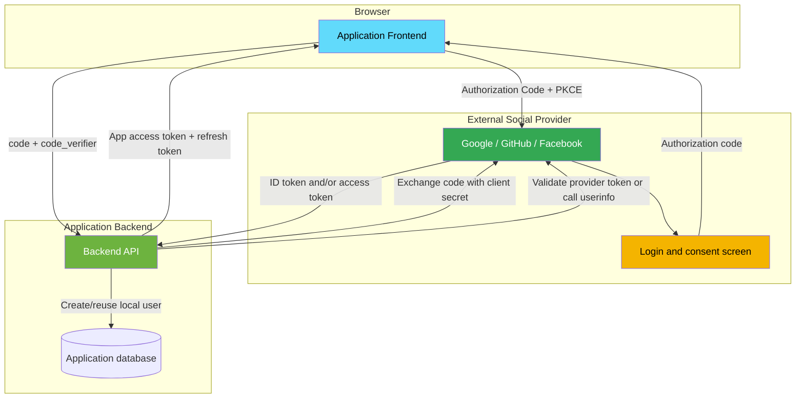
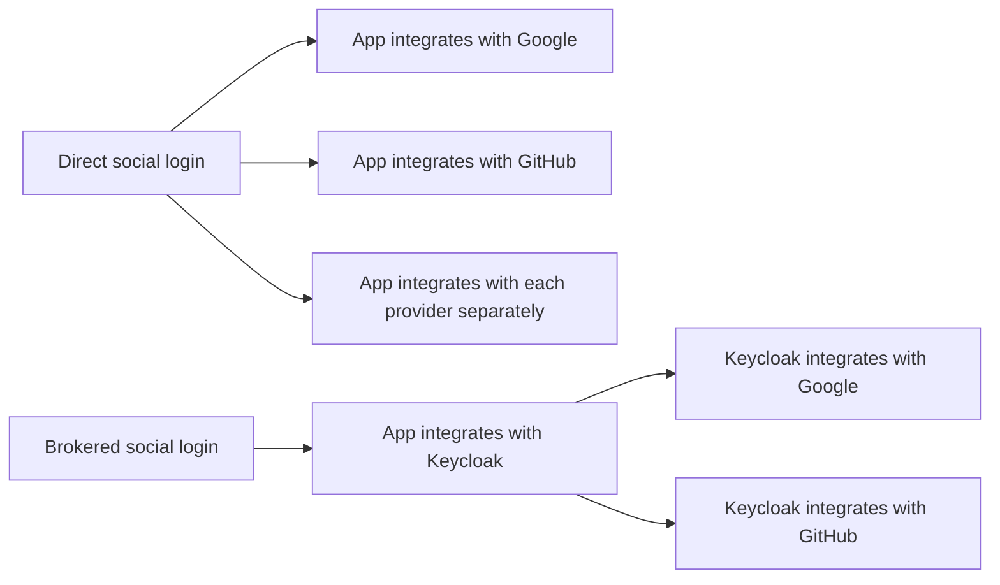
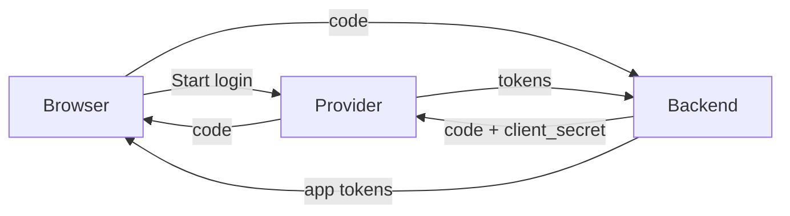
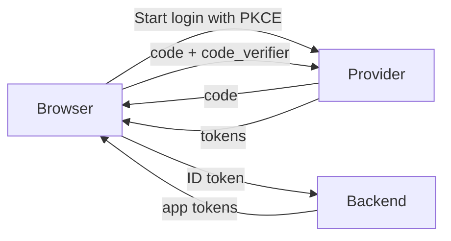
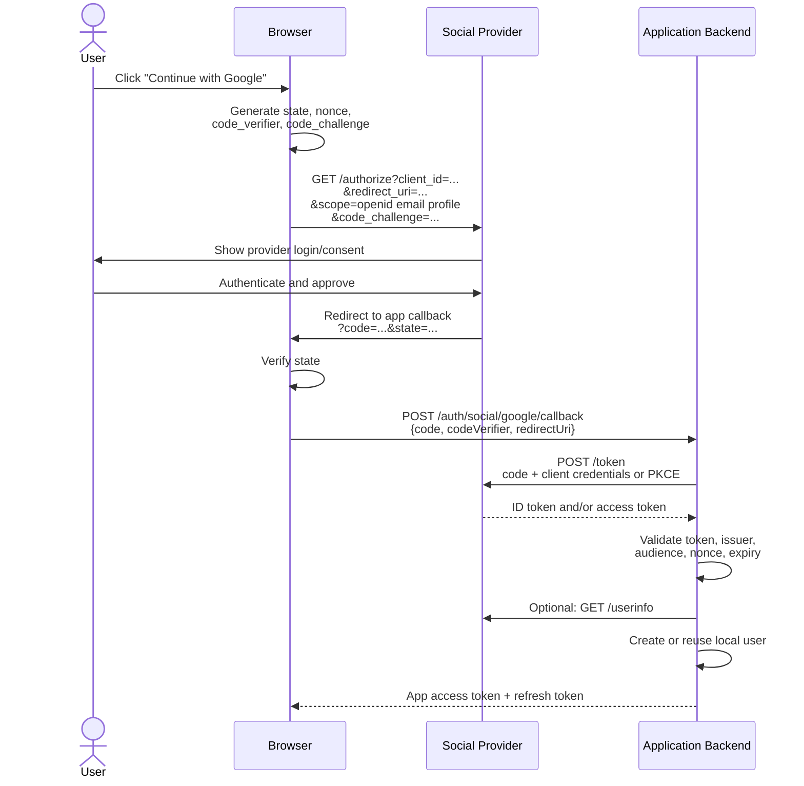
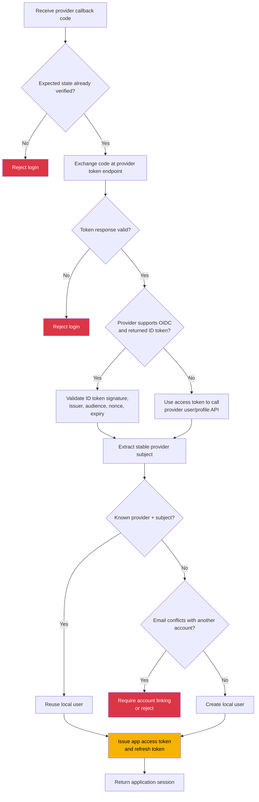
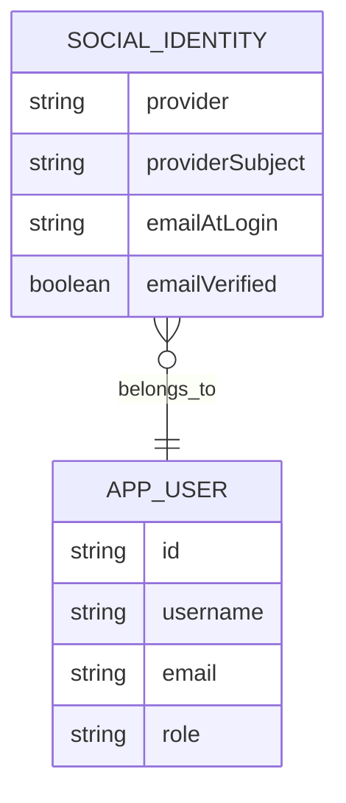
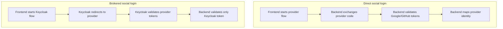

# Direct Social Login Without SSO

This document explains how social login works when the application talks directly to providers such as Google or GitHub, without using Keycloak, Okta, Auth0, Azure AD, or another SSO broker.

This is not how the local training stack currently implements social login. The repository uses Keycloak identity brokering; see [SOCIAL_LOGIN.md](SOCIAL_LOGIN.md). This document is the theory and design comparison for the direct-provider approach.

## Table of Contents

- [Overview](#overview)
- [What "Without SSO" Means](#what-without-sso-means)
- [Architecture](#architecture)
- [Browser Flow: Direct Provider Login](#browser-flow-direct-provider-login)
- [Backend Token Exchange](#backend-token-exchange)
- [OAuth vs OIDC](#oauth-vs-oidc)
- [User Mapping](#user-mapping)
- [Provider Differences](#provider-differences)
- [Security Requirements](#security-requirements)
- [Configuration](#configuration)
- [Practical Checks](#practical-checks)
- [Direct Social Login vs Brokered Social Login](#direct-social-login-vs-brokered-social-login)
- [When To Use Each Approach](#when-to-use-each-approach)

## Overview



The application owns the provider integration. For each social provider, the application must register an OAuth app, store client credentials, configure redirect URLs, validate provider responses, and decide how external identities map to local users.

The backend should still issue its own app token after social login. Provider tokens prove identity or grant access to provider APIs; they should not become the application's internal authorization token unless the whole application is intentionally designed as a resource server for that provider.

## What "Without SSO" Means

"Without SSO" does not mean "without OAuth". Social login still usually uses OAuth 2.0 and often OpenID Connect.

It means there is no central identity broker between the app and the provider:



In direct social login, Google/GitHub are not an enterprise SSO layer for the app. They are external identity providers that authenticate the user for one login transaction. The app still owns roles, local permissions, refresh tokens, account lifecycle, and domain data.

## Architecture

Direct social login usually uses one of two shapes.

### Backend-Mediated Code Exchange



This is the preferred shape for many web apps because the provider client secret stays on the backend. The frontend starts the redirect flow and handles the callback, but the backend completes the provider token exchange.

### Frontend Token Exchange With PKCE



This can work for public clients where the provider supports PKCE. The backend still must validate the ID token before issuing application tokens. The risk is that more provider token handling happens in the browser, so the implementation needs careful storage and lifetime choices.

## Browser Flow: Direct Provider Login



The browser redirect is still central. Social login is not just "call Google from the backend." The user must authenticate with the provider in a browser context so the provider can apply cookies, MFA, consent, bot checks, and account selection.

## Backend Token Exchange



The backend should never trust a user identity just because the frontend says "this is a Google user." The backend needs a cryptographically validated token or a provider API response obtained with a provider-issued access token.

## OAuth vs OIDC

OAuth 2.0 and OpenID Connect are related but not the same thing.

| Concept | OAuth 2.0 | OpenID Connect |
| --- | --- | --- |
| Primary purpose | Delegated authorization | Authentication on top of OAuth |
| Main token | Access token | ID token plus OAuth tokens |
| Best question it answers | "Can this app access something?" | "Who signed in?" |
| Common social-login use | Call provider API for profile/email | Validate ID token directly |

For authentication, OIDC is cleaner because the provider returns an ID token with identity claims such as `sub`, `iss`, `aud`, `email`, and `email_verified`.

Some providers or provider features are OAuth-first. GitHub, for example, is commonly used by calling API endpoints to fetch the authenticated user's profile and emails. In that model, the access token is used to ask the provider who the user is; the app then creates its own session.

## User Mapping

The safest local identity key is the pair:

```text
provider + providerSubject
```

Examples:

| Provider | Provider subject | Local meaning |
| --- | --- | --- |
| `google` | Google account `sub` | Stable Google identity |
| `github` | GitHub numeric user ID or stable node ID | Stable GitHub identity |

Do not use email as the only identity key. Email addresses can change, can be unverified, and can appear at multiple providers. Email is useful profile data and can support account linking, but it should not replace the provider's stable subject.



If the same email appears from multiple providers, the application needs a policy:

- Reject the new login and ask the user to sign in with the original method.
- Allow account linking only after the user proves control of the existing account.
- Auto-link only for providers and domains you explicitly trust.

Automatic email-based linking is convenient, but it is also where many account takeover bugs happen.

## Provider Differences

Each provider has different behavior. Direct social login means the application has to absorb those differences.

| Area | Google-style OIDC | GitHub-style OAuth |
| --- | --- | --- |
| Identity token | Usually ID token available with OIDC scopes | Often profile is fetched through API |
| Email | Can be in ID token if scope allows | May require separate email API call |
| Stable subject | `sub` claim | Provider user ID |
| Verification | Validate JWT via JWKS | Validate token by calling provider APIs |
| Scope examples | `openid email profile` | `read:user user:email` |

These details are exactly what an SSO broker hides from the application. Without a broker, the backend needs provider-specific adapters.

## Security Requirements

Direct social login should include:

| Requirement | Why |
| --- | --- |
| Authorization Code flow | Avoids implicit-flow token leakage |
| PKCE | Protects public browser clients and code exchange |
| `state` | Protects against login CSRF and callback mix-up |
| `nonce` for OIDC | Binds the ID token to the browser login request |
| Exact redirect URI matching | Prevents provider codes being sent to attacker-controlled URLs |
| Issuer validation | Prevents accepting tokens from the wrong provider/tenant |
| Audience/client validation | Prevents accepting tokens minted for another app |
| Signature validation | Proves the ID token was issued by the provider |
| Expiry validation | Prevents replaying old tokens |
| Server-side client secret storage | Keeps confidential provider credentials out of the browser |
| Account-linking policy | Prevents accidental or malicious identity merges |

Provider access tokens should be treated as secrets. Store them only if the app truly needs to call provider APIs later, and encrypt them at rest. If the only goal is login, discard provider tokens after creating the local application session.

## Configuration

For each provider, a direct integration usually needs:

| Setting | Example |
| --- | --- |
| Provider name | `google`, `github` |
| Client ID | From provider developer console |
| Client secret | Backend secret store |
| Authorization endpoint | Provider `/authorize` URL |
| Token endpoint | Provider `/token` URL |
| JWKS URI | Provider signing keys, for OIDC providers |
| Userinfo/profile endpoint | Provider user API |
| Redirect URI | `https://app.example.com/auth/social/google/callback` |
| Scopes | `openid email profile` or provider-specific equivalents |

Local development usually needs separate OAuth apps or redirect URIs for `localhost`, because providers validate callback URLs exactly.

## Practical Checks

When implementing or debugging direct social login, verify these points first:

1. The provider OAuth app has the exact callback URL used by the frontend/backend.
2. The authorization URL includes the expected `client_id`, `redirect_uri`, `scope`, `response_type=code`, `state`, and PKCE challenge.
3. The callback `state` matches the value stored before redirecting to the provider.
4. The backend exchanges the code only once. Authorization codes are single-use.
5. The ID token `iss`, `aud`, `nonce`, and `exp` match expectations.
6. The local user mapping uses `provider + subject`, not just email.
7. The app returns its own access token and refresh token after successful validation.
8. Provider tokens are not logged.

Useful debug artifacts:

| Artifact | What to inspect |
| --- | --- |
| Authorization URL | Client ID, scopes, redirect URI, state, PKCE challenge |
| Callback request | Code and state |
| Token response | Token type, expiry, scopes, ID token presence |
| Decoded ID token | `iss`, `aud`, `sub`, `email`, `email_verified`, `nonce`, `exp` |
| Local user row | Provider, provider subject, email, role |

## Direct Social Login vs Brokered Social Login



| Area | Direct social login | Brokered social login |
| --- | --- | --- |
| App integrates with | Every social provider | One broker/SSO system |
| Backend validates | Google/GitHub/provider tokens | Broker-issued tokens |
| Provider-specific logic lives in | Application backend | Broker configuration |
| Adding a provider requires | Backend/frontend/config changes | Mostly broker config |
| Best for | Small apps, simple provider list, full app control | Training, enterprises, many providers, centralized identity policy |
| Operational burden | App team owns provider details | Identity platform owns provider details |

## When To Use Each Approach

Direct social login is a reasonable choice when:

- The app supports only one or two providers.
- You want minimal infrastructure.
- You do not need enterprise SSO, centralized identity policy, or shared sessions across multiple apps.
- The backend team is comfortable owning OAuth/OIDC provider differences.

Brokered social login is usually better when:

- Multiple applications should share one identity layer.
- You need SAML, enterprise OIDC, LDAP, MFA policy, or account federation.
- You want the application backend to validate one issuer instead of many providers.
- You expect provider configuration to change independently of app releases.

In both designs, the final application session should be owned by the application. Social providers authenticate the user; the application still authorizes what that user can do.
