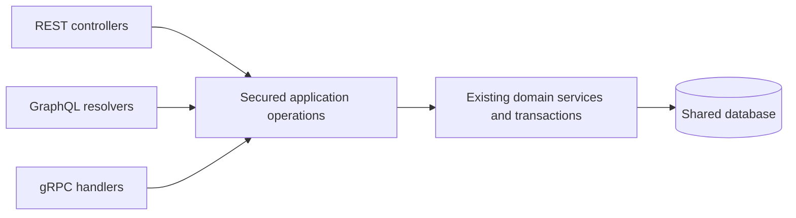

# GraphQL and gRPC implementation plan

Status: GraphQL commerce, the optional GraphQL storefront, GraphiQL, and native
admin inventory gRPC are implemented locally. Protocol-aware traffic visibility
and teaching assets are implemented and locally verified. No public release.

Prepared: 2026-09-20.

## Objective

Add GraphQL and gRPC as practical testing surfaces for the existing e-commerce
application. Preserve the existing REST API and keep the existing
`ai-testers-api` tests passing without changing their assertions, request
payloads, or expected responses to accommodate the new protocols.

Deliver GraphQL for the customer shopping journey first, an optional GraphQL
storefront mode second, and native gRPC inventory operations third. All
interfaces use the same application services and data.

This document records the implemented protocols and storefront alongside the
remaining rollout work. Public deployment checks have not
been performed.

Implementation entry point: [local course compatibility verification](COURSE_COMPATIBILITY.md).
Results: [implementation verification](GRAPHQL_IMPLEMENTATION_VERIFICATION.md).
Implementation details and operation examples are in
[`test-secure-backend/docs/GRAPHQL.md`](../../test-secure-backend/docs/GRAPHQL.md).

## Implemented backend scope

The requested scope now includes administration as well as the customer journey:

- Products: authenticated shared catalog; admin create, update, and delete.
- Carts: customers access their own cart; admins can select an owner and list
  nonempty carts. All cart mutations follow the same ownership policy.
- Orders: customers list/read/cancel their own orders; admins can query every
  order, filter by customer, cancel orders, and update status.
- Inventory: admin-only inventory details, listing, movement history, and
  idempotent adjustments. Customers can see availability in catalog products.
- JWT-protected `/api/v1/graphql`, enabled automatically through the globally included
  `graphql` Spring profile.
  REST routes, default frontend transport, deployed image pins, and database
  schema remain compatible.
- Thin resolvers delegate to secured, validated application services and reuse
  existing domain transactions. Records model GraphQL views; money uses exact
  decimal strings. Tests use Given/When/Then.

The backend portions of Phases 1–3 are implemented, including admin operations.
GraphiQL is now enabled at `/api/v1/graphiql`, with authenticated schema exploration
and execution. Raw GraphQL bodies are excluded from Logbook; the traffic viewer
shows safe protocol metadata without retaining operation payloads.
Page, body, depth, and complexity limits are enforced; the five-second
transaction timeout is not an end-to-end request deadline. Join fetching and
batched repository reads address cart product loading without a DataLoader.
Phase 4 is implemented locally: a per-tab REST/GraphQL selector, adapters for all
commerce operations, nested cart data, and cache clearing on switching/logout.
See [the storefront guide](../../vite-react-frontend/docs/GRAPHQL_STOREFRONT.md).
Its normal, browser, and both mutation layers passed; see
[storefront verification](GRAPHQL_STOREFRONT_VERIFICATION.md).
Phase 5 is implemented locally: four versioned admin inventory RPCs, JWT metadata
authentication, explicit Protobuf presence, status mapping, product-scoped
idempotency, client deadlines, protected health and optional reflection, and a
loopback-only Compose override. See [gRPC usage](GRPC_INVENTORY.md) and
[verification](GRPC_VERIFICATION.md). Phase 6 adds protocol traffic and the
[testing lab](PROTOCOL_TESTING_LAB.md). Phase 7 public release remains pending.

## Inspected baseline

| Repository | Relevant current structure |
| --- | --- |
| `test-secure-backend` | Spring Boot 4.1.0, Java 25, Spring MVC, JWT security, JPA, reusable product/cart/order/inventory services |
| `vite-react-frontend` | React, TanStack Query, Axios API layer in `src/lib/api.ts`, cart enrichment in `src/hooks/useEnrichedCart.ts` |
| `awesome-localstack` | Lightweight, full, and server Compose configurations; nginx gateways; immutable application image releases |
| `ai-testers-api` | Independent lesson projects `l1` through `l20`; `l20` has `api` and `admin-api` Playwright projects |

Specific findings affecting implementation:

- The cart currently requests product details separately for each item.
- REST controllers contain role checks and Bean Validation entry points that
  new protocol handlers would not automatically inherit.
- Checkout locks cart/product rows, deducts inventory, and clears the cart in
  a transaction. Cancellation conditionally restores inventory.
- Inventory adjustments already use a product-scoped request ID and reject
  replay with a different delta or reason.
- Product listing already has an offset/limit service method with a limit cap.
- Traffic capture currently selects Swagger-documented REST controller methods.
- The gateways route `/api/v1/` to the backend; an unconfigured `/graphql`
  request would follow the frontend route.
- The course suite defaults to public environments. Its `.env.local` loading
  uses `override: true`, so shell environment variables alone are not sufficient
  proof that a run targets the intended local environment.

## Non-negotiable compatibility contract

1. Keep existing REST paths, methods, status codes, response bodies, headers
   relied on by clients, pagination, validation, and error semantics.
2. Preserve authentication, refresh, SSO, MFA, ownership, and admin behavior.
3. Preserve existing seed accounts and fixture assumptions needed by lessons.
4. Keep REST as the default frontend mode and preserve existing UI routes and
   selectors used by browser tests.
5. Do not remove or rename existing OpenAPI operations or schemas. Check whether
   existing course assertions require exact OpenAPI structure before making
   even additive documentation changes.
6. Do not weaken, skip, or rewrite existing course assertions to pass a release.
   Environment configuration may differ; the test contract must not.
7. Keep database changes additive and compatible with the previous application
   image. Prefer no schema changes for the initial protocol adapters.
8. Regressions introduced by this work block release. A pre-existing failure
   must be recorded and resolved or explicitly dispositioned before claiming
   the unchanged suite is green; it cannot silently become an allowed failure.

REST, GraphQL, and gRPC have different transport error formats. Compatibility
means unchanged REST behavior and equivalent business outcomes through the new
interfaces, not identical wire responses across protocols.

## Architecture and scope

Use thin protocol adapters in the existing backend process. Do not call the
backend's REST endpoints from its own GraphQL or gRPC handlers. Do not expose
JPA entities or repositories directly as the new public contracts.

Keep login, token refresh, SSO, MFA, email, and LLM APIs on their existing
interfaces initially. Defer GraphQL subscriptions, federation, native gRPC
browser integration, and service extraction.

Proposed runtime controls, with final names chosen during implementation:

- GraphQL is always included alongside REST, as requested. gRPC remains a
  separately planned addition.
- REST/GraphQL storefront selection, defaulting to REST.
- Separate control of GraphiQL, schema exploration, and gRPC reflection for
  training environments.

## Phase overview

| Phase | Deliverable | Dependency |
| --- | --- | --- |
| 0 | Reproducible compatibility baseline | None |
| 1 | Shared security/validation boundary and protocol contracts | Phase 0 |
| 2 | GraphQL catalog and cart reads | Phase 1 |
| 3 | GraphQL cart writes, checkout, and customer orders | Phase 2 |
| 4 | Optional GraphQL storefront mode | Phase 3 |
| 5 | Authenticated native gRPC inventory API | Phase 1; scheduled after Phase 4 |
| 6 | Complete protocol visibility and training material | Incremental during Phases 2–5 |
| 7 | Whole-stack release verification and staged rollout | Phases 0–6 |

Each phase should be independently reviewable. GraphQL may ship before gRPC
if it completes the applicable Phase 7 gates.

## Phase 0 — Freeze and reproduce the compatibility baseline

### Work

- Record the commit IDs and dirty state of all participating repositories;
  preserve unrelated work. Record the deployed compatibility image set.
- Inventory runnable lesson projects and scripts. `l20` is the latest inspected
  suite; do not assume it fully subsumes earlier lessons.
- Build a lesson coverage matrix showing unique scenarios and setup needs.
- Create a disposable compatibility environment with stable seeded accounts
  and separate ordinary/admin test targets where required by the fixtures.
- Inspect required environment variables from each lesson's support files.
  Provision test credentials through untracked configuration; do not copy
  secrets into reports or this plan.
- Use disposable test-repository copies or an isolated runner configuration so
  local targeting does not overwrite the participant checkout's environment.
- Verify effective `API_BASE_URL` and `API_ADMIN_BASE_URL` after dotenv loading.
  Fail the local runner if either resolves to a public host.
- Capture the baseline OpenAPI document, test counts, failures, skips, retries,
  and relevant fixtures. Resolve setup failures before implementation.
- Run all runnable existing lesson suites once against the baseline, with
  fixture isolation/reset between suites where required. Identify any lessons
  that are instructional scaffolding rather than runnable suites explicitly.

### Acceptance gate

- Latest suite and runnable historical lesson suites pass on the baseline.
- The exact same pinned test revisions and assertions can run against a
  candidate image set.
- The compatibility report documents environment and fixture requirements.

## Phase 1 — Define contracts and secure shared operations

### Work

- Inventory authorization and validation for every operation to be exposed.
  Include checks currently enforced only by REST annotations or DTO binding.
- Introduce secured application facades or service-level checks where needed,
  while retaining REST controller protections and REST error translation.
- Derive customer identity from the authenticated principal; never accept an
  arbitrary customer username for a self-service cart or order operation.
- Keep explicit admin operations separate from customer operations. Audit
  unscoped methods such as order-by-ID and inventory adjustment before reuse.
- Ensure positive add quantities, zero-as-remove update semantics, address
  constraints, stock rules, and pagination bounds match the existing contract.
- Reuse existing JWT validation and account/role semantics. Specify which token
  types are accepted; do not accidentally accept refresh or MFA challenge
  tokens as access tokens.
- Define decimal money, IDs, timestamps, pagination, nullability, and domain
  error codes for both new protocols. Avoid floating-point money.
- Specify GraphQL omission versus explicit null behavior for update inputs.
- Keep transactions in application operations. Multiple GraphQL mutation fields
  must not be advertised as one atomic transaction.
- Preserve existing order transition behavior. Any desired policy tightening
  that changes REST behavior is a separate decision outside this rollout.

### Acceptance gate

- Existing REST security, validation, and business tests pass unchanged.
- Direct application-operation tests reject unauthorized and invalid calls.
- Protocol contracts and their mappings to existing operations are reviewed.
- Run the unchanged latest course suite after shared behavior changes.

## Phase 2 — GraphQL catalog and cart queries

### Work

- Add the Boot-compatible GraphQL starter and test support using the project's
  dependency management; verify resolved versions in the actual Maven build.
- Add SDL and thin query resolvers. The implementation uses
  `src/main/resources/graphql-preview/`, loaded by the automatically included `graphql` profile.
- Configure the endpoint as `/api/v1/graphql` and retain current authentication
  requirements, including for catalog reads.
- Define `products`, `product`, and `cart` queries. Start with bounded
  offset/limit pagination aligned with existing services.
- Return nested product details in cart items and server-calculated totals.
  Distinguish cart price snapshots from current catalog prices.
- Batch product lookups with request-scoped loading. Add query-count evidence
  so a single HTTP query does not conceal database N+1 behavior.
- Define missing-object and field-error behavior deliberately, including
  non-null propagation and stable `errors[].extensions.code` values.
- Add request size, page size, depth, complexity/alias limits and execution
  time bounds. Do not assume existing authentication rate limits cover query
  cost or repeated operations in a single request.
- Explicitly reject unsupported HTTP batching. Restrict writes to mutations.
- GraphiQL is enabled alongside GraphQL in every application profile at the user’s
  request. Verify its route, endpoint URL, and bearer-token flow through nginx;
  only the editor GET is public. See [verification](GRAPHIQL_VERIFICATION.md).
- Add minimal sanitized GraphQL operation visibility immediately; complete the
  common traffic presentation in Phase 6.

### Acceptance gate

- Query tests cover selections, variables, aliases, invalid schema fields,
  invalid inputs, missing products, unauthenticated access, and bounded cost.
- Cart queries do not expose another user's cart or sensitive entity fields.
- Prices and totals match the existing business semantics.
- Direct backend and gateway requests return GraphQL responses, not SPA HTML.
- Existing REST and latest course tests remain green.

## Phase 3 — GraphQL shopping mutations and orders

### Work

- Add `addCartItem`, `updateCartItem`, `removeCartItem`, and `clearCart`.
- Add `checkout`, `orders`, `order`, and `cancelOrder` with ownership checks.
  `orders` defaults to the current customer; admins may list all or filter by owner.
- Reuse existing checkout/cancellation transactions and stock locking.
- Validate mutation inputs at the new boundary, even when DTOs originated in
  REST code. Map business failures without leaking internal exception details.
- Specify retry behavior. Existing inventory adjustment idempotency does not
  imply checkout is idempotent. Do not automatically retry checkout or additive
  cart writes after an uncertain response.
- If checkout idempotency becomes a requirement, design it as explicit shared
  application behavior with separate compatibility review and migration tests.
- Preserve order price history if catalog prices change after purchase.
- Include GraphQL administration for products, carts, orders, and inventory,
  as requested. Require role checks and cross-user negative tests for every root.

### Acceptance gate

- Complete shopping flow succeeds entirely through GraphQL after existing login.
- Negative cases include empty cart, invalid quantities/address, insufficient
  stock, cross-user access, and cancellation in disallowed states.
- PostgreSQL concurrency tests verify no overselling and no duplicate stock
  restoration. Do not rely on H2 alone for locking evidence.
- Cross-protocol tests add via REST/read via GraphQL and mutate via
  GraphQL/read via REST, using isolated fixtures.
- GraphQL error assertions inspect the response body as well as HTTP status.
- Unchanged latest course suite passes; rerun affected historical coverage.

## Phase 4 — Optional GraphQL storefront

### Work

- Add a transport abstraction around shopping operations in the frontend.
- Retain the current REST implementation and default behavior.
- Add typed GraphQL operations and a response adapter for existing components.
  Prefer the existing TanStack Query setup; a second caching framework is not
  required solely to send GraphQL requests.
- Reuse token acquisition/refresh behavior and handle transport authentication
  failures separately from GraphQL execution errors.
- Add explicit REST/GraphQL mode selection suitable for training. Keep it
  visible enough that students know which protocol their browser is using.
- Include protocol and authenticated identity in appropriate query cache keys,
  or clear affected caches on switching/logout. Never switch mid-mutation.
- Replace per-item enrichment in GraphQL mode with the nested cart result.
- Preserve page URLs, accessible behavior, and existing test selectors.

### Acceptance gate

- Existing frontend tests pass with REST as default.
- The same core browser journey passes in both modes: sign in, browse, cart,
  checkout, order history, cancellation.
- Network assertions show GraphQL shopping requests in GraphQL mode and the
  unchanged REST requests in REST mode; no silent protocol fallback.
- Error, loading, refresh, logout, and mode-switch behavior are tested.

## Phase 5 — Native gRPC inventory API

### Work

- Verify the compatible Spring Boot gRPC server starter and Protobuf code
  generation setup in the actual backend build. Avoid copying version numbers
  from a different Boot generation.
- Define a versioned package, for example `awesome.inventory.v1`, with
  `GetStock`, `ListInventory`, `AdjustStock`, and `ListStockMovements` RPCs.
- Match existing admin inventory authorization for these RPCs initially.
- Add handlers that call the secured inventory application operations.
- Validate access tokens from gRPC metadata, propagate the authenticated
  principal into authorization/audit logic, and clear per-call context safely.
  The servlet JWT filter does not protect a separate native gRPC listener.
- Define presence semantics for optional fields and reserve removed Protobuf
  field numbers/names. Do not reuse tags or equate absent values with zero.
- Map invalid input, missing identity, insufficient permissions, missing
  products, and stock conflicts to documented gRPC status codes.
- Preserve product-scoped request-ID idempotency and payload mismatch detection.
- Specify client deadlines and safe retry policies. A timeout does not prove
  that a database write rolled back; reconcile/retry using the same request ID.
- Start with a separately configured local listener, proposed port `9091` after
  conflict checks. The full stack already publishes Prometheus on `9090`.
- Add health support and training-only reflection controls. Provide `.proto`
  files so testing does not depend on reflection being enabled.
- Keep server deployment internal initially. Public gRPC exposure requires an
  end-to-end HTTP/2/TLS design across the actual edge and gateway, including
  trailers, limits, and timeout behavior; ordinary HTTP/1.1 proxying is not enough.
- Defer `WatchStock` streaming until unary operations are stable. Streaming
  would also need an event source, ordering, backpressure, reconnect semantics,
  and authorization over the stream lifetime.

### Acceptance gate

- Generated-client and network-level tests cover authentication, authorization,
  validation, statuses, pagination, deadlines, and request-ID replay.
- Concurrent same-ID adjustments create only one movement; different-payload
  replay fails; stock cannot fall below zero.
- REST/GraphQL reads observe committed gRPC adjustments, and reverse-direction
  consistency is verified where the protocols expose the same operation.
- Verify the real listener in addition to in-process tests. If a proxied route
  is introduced, test both direct and public routes.
- The unchanged REST compatibility suite passes.

## Phase 6 — Traffic visibility and teaching assets

Implemented locally. See [verification evidence](PROTOCOL_TRAFFIC_VERIFICATION.md)
and the [protocol testing lab](PROTOCOL_TESTING_LAB.md).

### Work

- Add protocol-aware capture for GraphQL and gRPC; retain existing REST traffic
  response shapes and behavior for existing consumers.
- Record sanitized operation/RPC name, duration, outcome, and correlation ID.
  Represent GraphQL execution errors and gRPC statuses explicitly.
- Never label an operation successful solely because GraphQL returned HTTP 200.
- Sanitize variables, inline GraphQL literals, error payloads, metadata, and
  nested message fields. Do not log tokens or shipping addresses by default.
- Bound captured payload size and metric cardinality. Do not use arbitrary
  operation text, user IDs, or raw variables as metric labels.
- Provide sample GraphQL documents, variables, expected responses, and
  authenticated gRPC commands with placeholders rather than credentials.
- Document one equivalent scenario across REST, GraphQL, and gRPC where their
  operation coverage overlaps, especially inventory read/write consistency.
- Explain GraphQL partial errors, Protobuf presence/evolution, retry ambiguity,
  and the difference between HTTP and gRPC status semantics.
- Keep new learning exercises separate from frozen compatibility assertions.

### Acceptance gate

- Students can identify the protocol and diagnose a failed operation from the
  tools without exposing sensitive data.
- Existing traffic API tests pass; sanitization tests cover both new protocols.
- Examples run against the documented local profile.

## Phase 7 — Whole-stack verification and release

In progress with deployment authorization. See the [release record](GRAPHQL_GRPC_RELEASE.md).

### Work

- Build and pin a candidate application image set; test those exact artifacts.
- Synchronize lightweight, full, and server configuration and
  `docs/PROFILE_URLS.md`, `docs/STUDENT_GUIDE.md`, and release documentation.
- Validate each modified Compose file with `docker compose -f <file> config
  --quiet`; validate merged override configurations if overrides changed.
- Verify GraphQL default availability and optional gRPC configurations, startup health, route
  forwarding, and separation between stable and disposable server backends.
- Run the unchanged latest course suite and all runnable historical lesson
  suites at their pinned revisions against the candidate environment. Compare
  test counts/skips with baseline; do not equate fewer tests with compatibility.
- Repeat PostgreSQL integration/concurrency checks where service or database
  behavior changed; reuse passing evidence for unchanged artifacts.
- Run frontend REST and GraphQL journeys and protocol-specific backend tests.
- Stage release in a disposable environment first. Promote the verified image
  set under the project's deployment authorization and release workflow.

### Release gate

- All applicable phase gates pass with recorded evidence.
- No existing course test has been weakened, disabled, or changed to accept a
  regression. No unexplained failures or new skips remain.
- REST remains the frontend default and works alongside the always-available GraphQL API.
- Deployment docs match actual routes, ports, and profile behavior.

## Verification commands and mutation testing

Run commands in the named repository. These are implementation checks, not
commands executed as part of writing this plan.

| Scope | Command / procedure |
| --- | --- |
| Backend routine verification | `./mvnw verify` |
| Backend integration/concurrency | `./mvnw -Pintegration-tests verify` |
| Backend framework mutation when configured scope changes | `./mvnw -Pmutation-testing test-compile pitest:mutationCoverage` |
| Frontend unit/build/static checks | `npm test`, `npm run build`, `npm run lint` |
| Frontend browser checks | `npm run test:e2e` with the intended local stack/configuration |
| Frontend framework mutation when configured scope changes | `npm run test:mutation` |
| Latest inspected course suite | In an isolated `ai-testers-api/l20` copy: `npm ci`, then `npm test`, after validating both effective target URLs and required credentials |
| Historical course suites | Use each lesson's inspected scripts and lockfile; no root-level runner currently established by this review |
| Semantic mutation | Use `experiments/llm-mutation` after normal verification and applicable framework mutation |

New resolver/RPC classes are not automatically covered by existing PITest
targets. Review and explicitly extend targeted mutation scope where warranted.
Similarly, the current Stryker scope must be inspected before claiming coverage
of a new frontend transport adapter.

For each change to high-risk behavior, freeze one to three semantic mutants
before strengthening tests. Useful candidates include:

- Bypass ownership when resolving an order through GraphQL.
- Apply a repeated gRPC stock adjustment a second time.
- Omit inventory restoration or restore twice on cancellation.

Run candidates only in disposable copies. Candidates must compile; compilation
failures are invalid, not kills. Report killed, survived, invalid, and equivalent
separately, and keep semantic results separate from the framework mutation score.
For a meaningful survivor, add a test that passes on the original and fails on
the frozen mutant.

## Evidence required for each handoff

- Repository/test commit IDs and candidate image references.
- Changed contracts, routes, runtime controls, and any schema migration.
- Commands, environment, test counts, skips, retries, and results.
- REST compatibility results and cross-protocol business assertions.
- Framework mutation results and separate semantic classifications.
- Remaining limitations and deferred work.
- Rollback work is excluded at the user’s request.

## References

- [Spring Boot GraphQL integration](https://docs.spring.io/spring-boot/reference/web/spring-graphql.html)
- [Spring GraphQL testing](https://docs.spring.io/spring-graphql/reference/testing.html)
- [Spring Boot gRPC integration](https://docs.spring.io/spring-boot/reference/io/grpc.html)
- [gRPC deadlines](https://grpc.io/docs/guides/deadlines/)
- [gRPC-Web tutorial](https://grpc.io/docs/platforms/web/basics/)
- [Container releases](CONTAINER_RELEASES.md)
- [Mutation-testing playbook](MUTATION_TESTING_AGENT_PLAYBOOK.md)
- [Semantic mutation lab](../experiments/llm-mutation/README.md)

Framework documentation evolves. Recheck the version-specific starter and
configuration APIs against the resolved backend dependencies during Phase 1.
