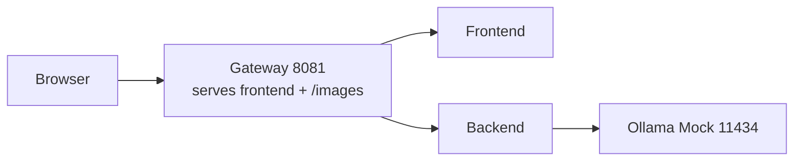
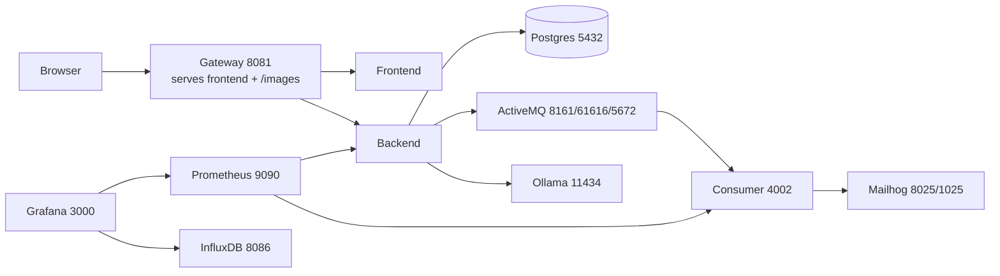
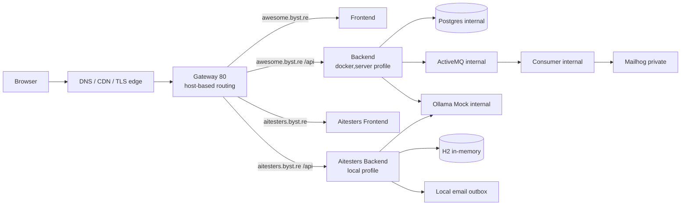

# Profile URL Guide

This file documents what each main Docker profile actually publishes on the host, and which URLs you should use first.

Each profile now uses its own fixed Compose project name:

- full: `awesome-full`
- lightweight: `awesome-light`
- server: `awesome-server`
- ci: `awesome-ci`

That keeps profile switching from producing normal orphan warnings just because the profiles declare different services.

Profiles still cannot share the same host ports at the same time. For example, `full` and `lightweight` both use `8081` and `11434`.

## Core Rule

For the application itself, prefer the gateway URL:

- full local: `http://localhost:8081`
- lightweight local: `http://localhost:8081`
- server: `https://awesome.byst.re`

That gateway is the intended public surface for:

- frontend pages
- backend API under `/api/v1/...`
- Swagger UI under `/swagger-ui/...`
- OpenAPI under `/v3/api-docs`
- actuator under `/actuator/...`
- traffic WebSocket under `/api/v1/ws-traffic`
- static images under `/images/...`

## Mermaid Diagrams

### Lightweight



### Full



### Server



## Full Profile

Compose file:

- `docker-compose.yml`

Start command:

```bash
docker compose -f docker-compose.yml up -d
```

This compose path intentionally runs the backend with `docker,demo`, so the local PostgreSQL-backed stack includes seeded demo users, products, and sample orders.

Stop command:

```bash
docker compose -f docker-compose.yml down
```

Recommended app URLs:

- frontend: `http://localhost:8081/login`
- Swagger UI: `http://localhost:8081/swagger-ui/index.html`
- OpenAPI JSON: `http://localhost:8081/v3/api-docs`
- sign in API: `http://localhost:8081/api/v1/users/signin`
- images through gateway: `http://localhost:8081/images/iphone.png`

Published host ports:

| Service | Host URL / Port | Notes |
| --- | --- | --- |
| Gateway | `http://localhost:8081` | Main app entrypoint |
| Postgres | `localhost:5432` | Direct DB access |
| Prometheus | `http://localhost:9090/graph` | Monitoring UI |
| Grafana | `http://localhost:3000/login` | Login `admin/grafana` |
| ActiveMQ console | `http://localhost:8161` | Admin console |
| ActiveMQ JMS | `localhost:61616` | Broker port |
| ActiveMQ AMQP | `localhost:5672` | AMQP port |
| Mailhog UI | `http://localhost:8025/` | Dev inbox UI |
| Mailhog SMTP | `localhost:1025` | SMTP sink |
| Consumer metrics | `http://localhost:4002/actuator/prometheus` | Direct metrics |
| InfluxDB | `localhost:8086` | K6 / time-series |
| Ollama | `http://localhost:11434/api/tags` | Raw model API |
What is internal only:

- backend raw port `4001`
- frontend raw port `80`

## Lightweight Profile

Compose file:

- `lightweight-docker-compose.yml`

Start command:

```bash
docker compose -f lightweight-docker-compose.yml up -d
```

Stop command:

```bash
docker compose -f lightweight-docker-compose.yml down
```

Recommended app URLs:

- frontend: `http://localhost:8081/login`
- Swagger UI: `http://localhost:8081/swagger-ui/index.html`
- OpenAPI JSON: `http://localhost:8081/v3/api-docs`
- sign in API: `http://localhost:8081/api/v1/users/signin`
- images through gateway: `http://localhost:8081/images/iphone.png`

Published host ports:

| Service | Host URL / Port | Notes |
| --- | --- | --- |
| Gateway | `http://localhost:8081` | Main app entrypoint |
| Ollama mock | `http://localhost:11434` | Mocked LLM API |
What is not included:

- Postgres
- ActiveMQ
- Mailhog
- consumer
- Prometheus
- Grafana
- InfluxDB

What is internal only:

- backend raw port `4001`
- frontend raw port `80`

## Server Profile

Compose file:

- `docker-compose.server.yml`

Deployment command:

```bash
make ansible-deploy
```

Direct server stop command on the VPS:

```bash
docker compose -f docker-compose.server.yml down
```

Recommended public URLs:

Stable public playground:

- frontend: `https://awesome.byst.re/login`
- Swagger UI: `https://awesome.byst.re/swagger-ui/index.html`
- OpenAPI JSON: `https://awesome.byst.re/v3/api-docs`
- sign in API: `https://awesome.byst.re/api/v1/users/signin`
- authenticated email events: `https://awesome.byst.re/api/v1/users/me/email-events`
- images through gateway: `https://awesome.byst.re/images/iphone.png`

Disposable API/UI testing sandbox:

- frontend: `https://aitesters.byst.re/login`
- Swagger UI: `https://aitesters.byst.re/swagger-ui/index.html`
- OpenAPI JSON: `https://aitesters.byst.re/v3/api-docs`
- sign in API: `https://aitesters.byst.re/api/v1/users/signin`
- local email outbox: `https://aitesters.byst.re/api/v1/local/email/outbox`
- images through gateway: `https://aitesters.byst.re/images/iphone.png`

Hostname notes:

- `awesome.byst.re` is the stable production-like playground.
- `aitesters.byst.re` is a disposable sandbox for admin and mutation-heavy tests.
- `aitesters.awesome.byst.re` is accepted as an nginx alias, but it is not the recommended public URL because the current wildcard TLS certificate covers `*.byst.re`, not nested names such as `*.awesome.byst.re`.

Published host ports:

| Service | Host URL / Port | Notes |
| --- | --- | --- |
| Gateway | `80/tcp` | Public app entrypoint, usually behind public hostname |

Not published on the host:

- Postgres `5432`
- Grafana `3000`
- Mailhog UI `8025`
- Mailhog SMTP `1025`
- ActiveMQ console `8161`
- ActiveMQ JMS `61616`
- consumer `4002`
- backend `4001`
- frontend `80`
- aitesters-backend `4001`
- aitesters-frontend `80`
- ollama-mock `11434`

Special behavior:

- Swagger and OpenAPI are intentionally public as part of the demo surface
- `https://awesome.byst.re/mailhog/api/v2/messages` is blocked with `404`
- `https://awesome.byst.re/mailhog/` is blocked with `404`
- Mailhog remains available only through SSH tunnelling to remote `127.0.0.1:8025`
- `aitesters.byst.re` runs an additional backend with the Spring `local` profile
- `aitesters.byst.re` uses H2 in-memory data and seeded local demo users, including the demo admin
- `aitesters.byst.re` exposes local/test helpers such as `/api/v1/local/email/outbox` by design
- `aitesters.byst.re` is reset daily by the `aitesters-reset.timer` systemd timer

## Gateway Route Map

### Local Gateway

`nginx/conf.d/lightweight-app-gateway.conf` handles:

- `/api/v1/ws-traffic` -> backend
- `/api/v1/` -> backend
- `/swagger-ui/` -> backend
- `/v3/api-docs` -> backend
- `/actuator/` -> backend
- `/images/` -> gateway static files
- `/` -> frontend

### Server Gateway

`nginx/conf.d/app-gateway.conf` handles:

For `awesome.byst.re`:

- `/api/v1/ws-traffic` -> backend
- `/api/v1/` -> backend
- `/swagger-ui/` -> backend
- `/v3/api-docs` -> backend
- `/actuator/` -> backend
- `/images/` -> gateway static files
- `/mailhog`, `/mailhog/`, and `/mailhog/api/` -> `404`
- `/` -> frontend

For `aitesters.byst.re`:

- `/api/v1/ws-traffic` -> aitesters-backend
- `/api/v1/` -> aitesters-backend
- `/swagger-ui/` -> aitesters-backend
- `/v3/api-docs` -> aitesters-backend
- `/actuator/` -> aitesters-backend
- `/images/` -> gateway static files
- `/` -> aitesters-frontend

## Verification Commands

Full local:

```bash
curl -i http://localhost:8081/login
curl -i http://localhost:8081/v3/api-docs
curl -i http://localhost:8081/images/iphone.png
curl -i http://localhost:8025/
```

Lightweight local:

```bash
curl -i http://localhost:8081/login
curl -i http://localhost:8081/v3/api-docs
curl -i http://localhost:8081/images/iphone.png
curl -i http://localhost:11434/api/tags
```

Student-oriented lightweight smoke test:

```bash
docker compose -f lightweight-docker-compose.yml up -d
docker compose -f lightweight-docker-compose.yml ps
curl -i http://localhost:8081/login
curl -i http://localhost:8081/v3/api-docs
curl -i http://localhost:8081/images/iphone.png
curl -i http://localhost:11434/api/tags
```

Expected:

- all services are `Up`
- `login` returns `200`
- `v3/api-docs` returns `200`
- image request returns `200`
- mock LLM tags request returns `200`

Server:

```bash
curl -i https://awesome.byst.re/login
curl -i https://awesome.byst.re/v3/api-docs
curl -i https://awesome.byst.re/images/iphone.png
curl -i https://awesome.byst.re/mailhog/api/v2/messages
curl -i https://aitesters.byst.re/login
curl -i https://aitesters.byst.re/v3/api-docs
curl -i https://aitesters.byst.re/images/iphone.png
curl -i https://aitesters.byst.re/api/v1/local/email/outbox
```

Expected:

- `awesome.byst.re/login` returns `200`
- `awesome.byst.re/v3/api-docs` returns `200`
- `awesome.byst.re/images/iphone.png` returns `200`
- `awesome.byst.re/mailhog/api/v2/messages` returns `404`
- `aitesters.byst.re/login` returns `200`
- `aitesters.byst.re/v3/api-docs` returns `200`
- `aitesters.byst.re/images/iphone.png` returns `200`
- `aitesters.byst.re/api/v1/local/email/outbox` returns `200`

Internal-only checks on the VPS:

```bash
cd /opt/awesome-localstack
docker compose -f docker-compose.server.yml exec backend curl -i http://backend:4001/actuator/health
docker compose -f docker-compose.server.yml exec consumer curl -i http://consumer:4002/actuator/prometheus
docker compose -f docker-compose.server.yml exec gateway curl -i http://localhost/images/iphone.png
docker compose -f docker-compose.server.yml exec gateway curl -i http://activemq:8161
```
