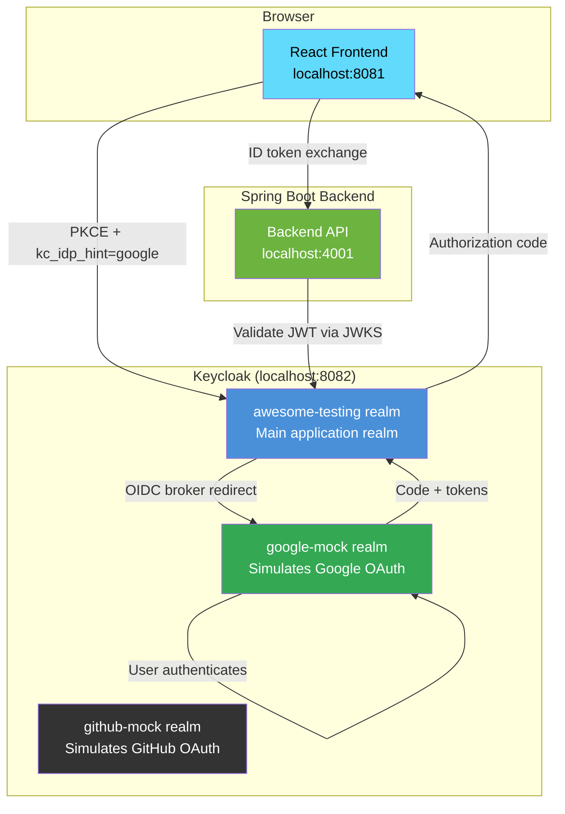
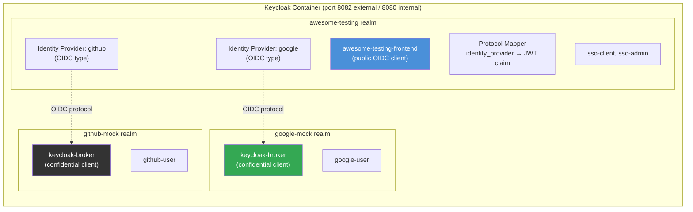
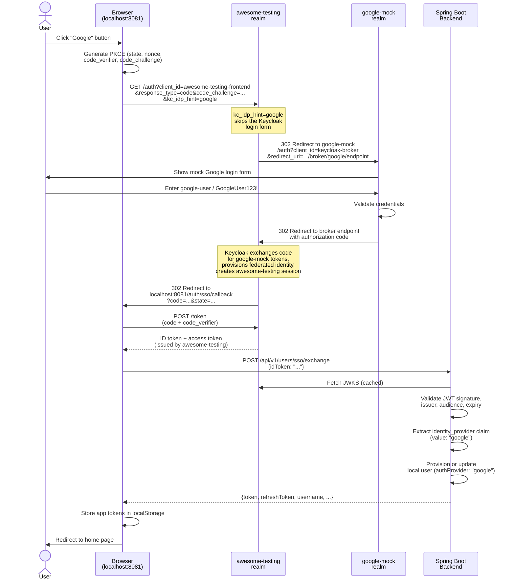
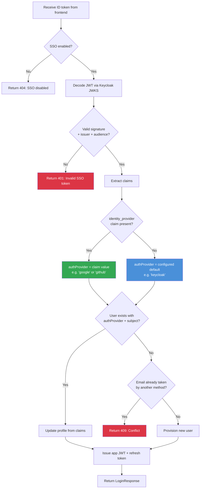
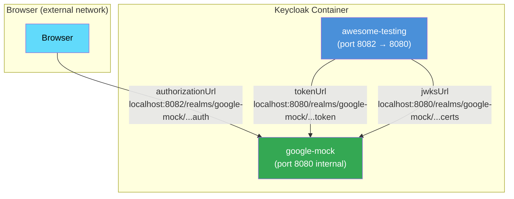
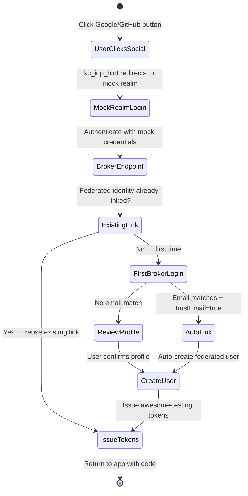
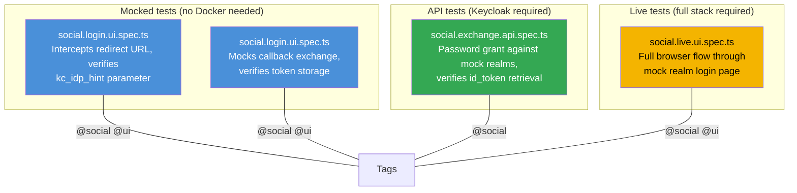

# Social Login Architecture

This document describes the mock social login system used in the training environment. The same Keycloak instance that handles SSO also simulates Google and GitHub as external identity providers, using a technique called **identity brokering**.

No real Google or GitHub OAuth apps are needed. Everything runs on `localhost`.

## Table of Contents

- [Overview](#overview)
- [Realm Architecture](#realm-architecture)
- [Browser Flow: Social Login](#browser-flow-social-login)
- [Token Flow: Backend Exchange](#token-flow-backend-exchange)
- [Identity Brokering Internals](#identity-brokering-internals)
- [First Broker Login](#first-broker-login)
- [Credential Reference](#credential-reference)
- [URL Reference](#url-reference)
- [Identity Provider Configuration](#identity-provider-configuration)
- [Frontend Implementation](#frontend-implementation)
- [Backend Implementation](#backend-implementation)
- [Playwright Test Strategy](#playwright-test-strategy)
- [Upgrade Path to Real Providers](#upgrade-path-to-real-providers)
- [Related: Direct Social Login Without SSO](#related-direct-social-login-without-sso)

## Overview



The key insight: **the backend never sees tokens from mock realms**. It always validates tokens issued by `awesome-testing`, regardless of which upstream provider the user authenticated with.

## Realm Architecture

Three Keycloak realms run on the same container:



| Realm | Purpose | Realm JSON file |
| --- | --- | --- |
| `awesome-testing` | Main app realm. Issues tokens the backend trusts. | `keycloak/realm-export.json` |
| `google-mock` | Simulates Google. Has one user and a broker client. | `keycloak/realm-google-mock.json` |
| `github-mock` | Simulates GitHub. Has one user and a broker client. | `keycloak/realm-github-mock.json` |

The docker-compose mounts the entire `keycloak/` directory so Keycloak auto-imports all three realm files on startup:

```yaml
volumes:
  - ./keycloak:/opt/keycloak/data/import:ro
```

## Browser Flow: Social Login

This is what happens when a user clicks "Google" on the login page:



## Token Flow: Backend Exchange

The backend validates the ID token and extracts provider metadata:



## Identity Brokering Internals

The identity provider config in `realm-export.json` uses a **split URL strategy** because Keycloak talks to itself:



| URL type | Network | Port | Why |
| --- | --- | --- | --- |
| `authorizationUrl` | Browser → Keycloak | `8082` (external mapped) | Browser redirect — must be reachable from host |
| `tokenUrl` | Keycloak → Keycloak | `8080` (internal) | Server-to-server within same container |
| `jwksUrl` | Keycloak → Keycloak | `8080` (internal) | Signature verification, container-internal |
| `userInfoUrl` | Keycloak → Keycloak | `8080` (internal) | Profile enrichment, container-internal |
| `issuer` | JWT validation | `8082` (external) | Must match the `iss` claim in tokens seen by browsers |

## First Broker Login

On the **first** social login, Keycloak runs its "first broker login" flow. This links the external identity to the `awesome-testing` realm:



After the first login, subsequent logins skip the review step entirely — the federated identity link is reused.

## Credential Reference

### Application Users (backend-owned)

| Username | Password | Role | Source |
| --- | --- | --- | --- |
| `admin` | `LocalDemoAdmin123!` | Admin | Backend demo seed |
| `client` | `client` | Client | Backend demo seed |

### SSO Users (awesome-testing realm)

| Username | Password | Email | Role |
| --- | --- | --- | --- |
| `sso-client` | `SsoClient123!` | `sso-client@example.test` | Client |
| `sso-admin` | `SsoAdmin123!` | `sso-admin@example.test` | Admin |

### Social Login Users (mock realms)

| Provider | Realm | Username | Password | Email |
| --- | --- | --- | --- | --- |
| Google | `google-mock` | `google-user` | `GoogleUser123!` | `google-user@gmail.com` |
| GitHub | `github-mock` | `github-user` | `GitHubUser123!` | `github-user@github.test` |

### Infrastructure

| Surface | Username | Password |
| --- | --- | --- |
| Keycloak Admin Console | `admin` | `admin` |

## URL Reference

| Surface | URL |
| --- | --- |
| Application login | `http://localhost:8081/login` |
| SSO callback | `http://localhost:8081/auth/sso/callback` |
| awesome-testing realm | `http://localhost:8082/realms/awesome-testing` |
| google-mock realm | `http://localhost:8082/realms/google-mock` |
| github-mock realm | `http://localhost:8082/realms/github-mock` |
| Keycloak Admin Console | `http://localhost:8082/admin/` |
| Backend SSO exchange | `POST http://localhost:8081/api/v1/users/sso/exchange` |
| OIDC discovery (awesome-testing) | `http://localhost:8082/realms/awesome-testing/.well-known/openid-configuration` |
| OIDC discovery (google-mock) | `http://localhost:8082/realms/google-mock/.well-known/openid-configuration` |
| OIDC discovery (github-mock) | `http://localhost:8082/realms/github-mock/.well-known/openid-configuration` |

## Identity Provider Configuration

The `awesome-testing` realm has two identity providers defined in `realm-export.json`:

```json
{
  "alias": "google",
  "displayName": "Google",
  "providerId": "oidc",
  "enabled": true,
  "trustEmail": true,
  "config": {
    "issuer": "http://localhost:8082/realms/google-mock",
    "authorizationUrl": "http://localhost:8082/realms/google-mock/protocol/openid-connect/auth",
    "tokenUrl": "http://localhost:8080/realms/google-mock/protocol/openid-connect/token",
    "clientId": "keycloak-broker",
    "clientSecret": "keycloak-broker-secret",
    "syncMode": "FORCE"
  }
}
```

The `keycloak-broker` client in each mock realm is **confidential** (has a secret) and allows:
- `standardFlowEnabled: true` — for browser-based brokering
- `directAccessGrantsEnabled: true` — for Playwright test fixtures (password grant)

The redirect URI is set to the broker endpoint: `http://localhost:8082/realms/awesome-testing/broker/{alias}/endpoint`

### KC_HOSTNAME and Issuer Consistency

The Keycloak container is configured with `KC_HOSTNAME: http://localhost:8082`. This is **critical** for identity brokering to work because:

1. The browser accesses Keycloak at `http://localhost:8082` (Docker port mapping `8082→8080`)
2. The broker exchanges tokens internally at `http://localhost:8080` (container-internal)
3. Without `KC_HOSTNAME`, Keycloak produces different issuers depending on request origin, causing `Invalid token issuer` errors on the userinfo endpoint

With `KC_HOSTNAME` set, Keycloak uses `http://localhost:8082` as the issuer in **all** contexts, ensuring consistency between browser-initiated sessions and server-to-server token exchanges.

### Mock User Password Initialization

The `keycloak-init` service (`curlimages/curl`) runs after Keycloak starts and resets mock user passwords via the admin API. Keycloak's `--import-realm` creates users from JSON but does not reliably hash plaintext passwords in all versions. The init script:

1. Waits for Keycloak to be ready (up to 270s)
2. Obtains an admin token
3. Resets passwords for `google-user` and `github-user` via `PUT /admin/realms/{realm}/users/{id}/reset-password`

## Frontend Implementation

The frontend adds a single URL parameter to the existing PKCE flow:

```typescript
// sso.ts — beginSocialLogin()
const authorizationUrl = createSsoUrl(
  `${config.authority}/protocol/openid-connect/auth`,
  {
    client_id: config.clientId,
    redirect_uri: config.redirectUri,
    response_type: 'code',
    scope: 'openid profile email',
    prompt: 'login',
    state,
    nonce,
    code_challenge: codeChallenge,
    code_challenge_method: 'S256',
    kc_idp_hint: provider,  // ← only difference from beginLogin()
  },
);
```

The callback URL is the same (`/auth/sso/callback`) regardless of provider. The `completeCallback()` function is unchanged.

## Backend Implementation

A protocol mapper on the `awesome-testing-frontend` client adds the `identity_provider` claim to the ID token:

```json
{
  "name": "identity-provider",
  "protocolMapper": "oidc-usersessionmodel-note-mapper",
  "config": {
    "user.session.note": "identity_provider",
    "id.token.claim": "true",
    "claim.name": "identity_provider",
    "jsonType.label": "String"
  }
}
```

The backend extracts this claim to set `authProvider`:

| Login method | `identity_provider` claim | `authProvider` stored |
| --- | --- | --- |
| Direct Keycloak SSO | absent/null | `keycloak` (config default) |
| Google (mock) | `google` | `google` |
| GitHub (mock) | `github` | `github` |

This means each provider creates a separate identity space. A user who logs in via Google and then via GitHub gets two separate app accounts (different `authProvider` + `providerSubject` pairs).

## Playwright Test Strategy

Social login tests use three approaches, matching the existing SSO test patterns:



Run social tests: `npx playwright test --grep @social`

## Upgrade Path to Real Providers

To switch from mock realms to real Google or GitHub OAuth:

1. **Register an OAuth app** at [Google Cloud Console](https://console.cloud.google.com/) or [GitHub Settings](https://github.com/settings/developers).
2. **Replace the identity provider config** in `realm-export.json`:
   - Change `authorizationUrl`, `tokenUrl`, `jwksUrl` to real provider endpoints
   - Replace `clientId` and `clientSecret` with registered OAuth app credentials
   - Update `issuer` to match the real provider
3. **No frontend changes** — `kc_idp_hint` values stay the same (`google`, `github`)
4. **No backend changes** — the `identity_provider` claim is set by Keycloak regardless of upstream provider

This is the core value of identity brokering: **the application is completely decoupled from identity provider details**. The same code works with mock realms in development and real providers in production.

## Related: Direct Social Login Without SSO

This document describes brokered social login: the application trusts the `awesome-testing` realm, and Keycloak handles Google/GitHub as upstream identity providers.

For the alternative architecture where the application integrates directly with Google or GitHub, stores provider OAuth client configuration, validates provider tokens itself, and maps provider identities to local users, see [DIRECT_SOCIAL_LOGIN.md](DIRECT_SOCIAL_LOGIN.md).
