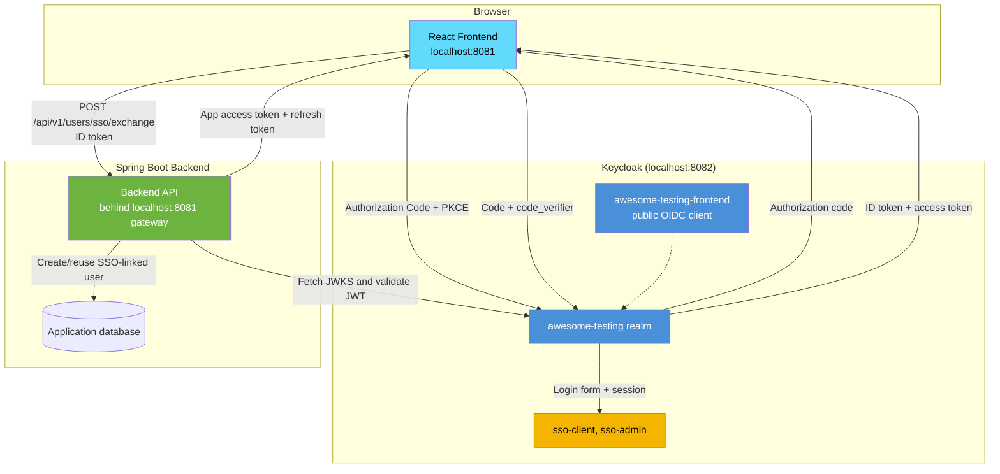
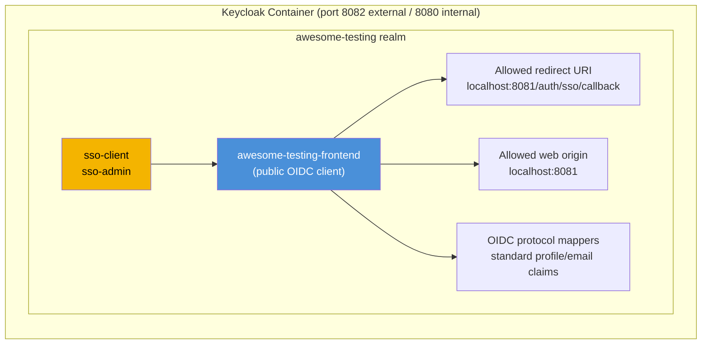
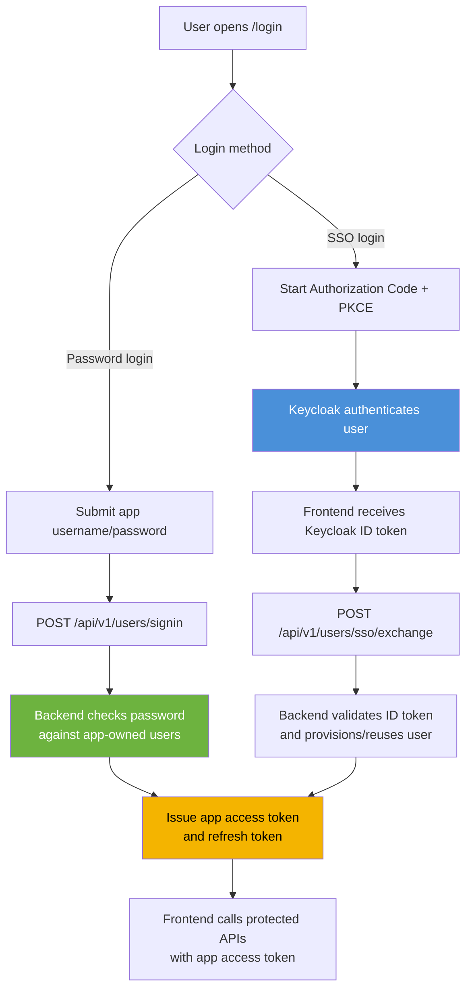
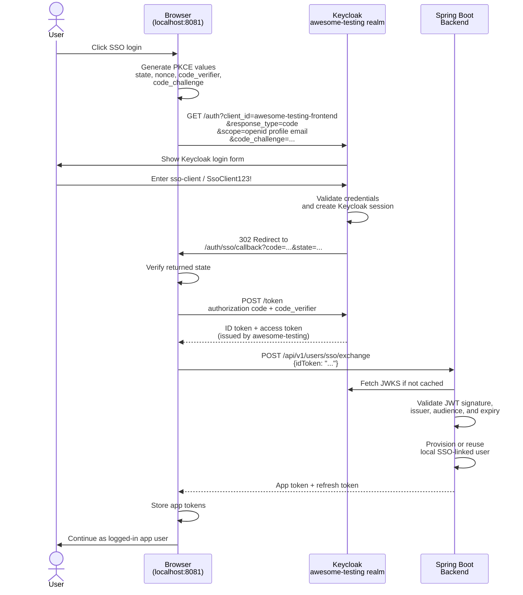
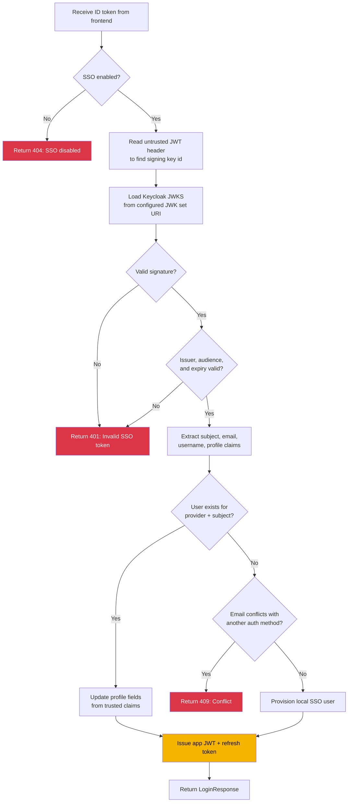
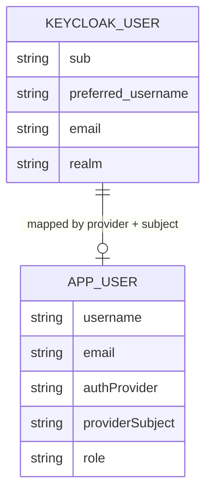

# Local SSO Flow

This document explains the local SSO training setup used by the `lightweight`, `full`, and `ci` profiles. It covers both the theory behind the flow and the practical checks you can run when something does not behave as expected.

The identity provider is Keycloak, exposed on `localhost:8082`. The application is still accessed through the gateway on `localhost:8081`.

The `server` profile keeps SSO disabled by default. Do not point production-like deployments at this local realm; server SSO needs a real issuer, real redirect URLs, managed credentials, and operational ownership of the identity provider.

## Table of Contents

- [Overview](#overview)
- [Local Architecture](#local-architecture)
- [Standard Login vs SSO Login](#standard-login-vs-sso-login)
- [Browser Flow: Keycloak SSO](#browser-flow-keycloak-sso)
- [Token Flow: Backend Exchange](#token-flow-backend-exchange)
- [Claims and Local User Mapping](#claims-and-local-user-mapping)
- [Credential Reference](#credential-reference)
- [URL Reference](#url-reference)
- [Configuration Reference](#configuration-reference)
- [Quick Checks](#quick-checks)
- [Inspecting Tokens and Discovery Metadata](#inspecting-tokens-and-discovery-metadata)
- [Troubleshooting](#troubleshooting)
- [Related Social Login Flow](#related-social-login-flow)

## Overview



The important separation is:

- Keycloak authenticates the user and issues OIDC tokens.
- The frontend sends the Keycloak ID token to the backend once.
- The backend validates the ID token and then issues the normal application tokens.
- Protected application APIs use the application JWT, not the raw Keycloak token.

This keeps the rest of the application independent from Keycloak-specific token details.

## Local Architecture

The local SSO setup has one main Keycloak realm for application SSO:



The realm definition lives in `keycloak/realm-export.json` and is imported by Keycloak at container startup. The same file also contains identity-provider configuration for mock social login; that is covered separately in [SOCIAL_LOGIN.md](SOCIAL_LOGIN.md).

The docker-compose files mount the realm exports into Keycloak:

```yaml
volumes:
  - ./keycloak:/opt/keycloak/data/import:ro
```

## Standard Login vs SSO Login

Both login methods end with the same application session model, but they prove identity differently.



| Area | Standard login | SSO login |
| --- | --- | --- |
| Who checks the password? | Backend application | Keycloak |
| Login form lives in | Application frontend | Keycloak-hosted page |
| Primary credential store | App database | Keycloak realm |
| Frontend endpoint | `POST /api/v1/users/signin` | `POST /api/v1/users/sso/exchange` after Keycloak login |
| Token used for app APIs | App JWT | App JWT |
| Refresh token owner | Backend application | Backend application |
| Local app user | Existing seeded/register-created user | Created or reused after validated SSO token |
| Password reset | App password reset flow | Managed by identity provider for SSO-only users |
| Main test value | App auth validation and token storage | Redirects, external identity, token exchange, user provisioning |

The design intentionally normalizes both paths into the same downstream session. Product, cart, order, profile, and admin tests should not need to know whether the user originally authenticated with a password or with SSO.

## Browser Flow: Keycloak SSO

This is the direct Keycloak SSO flow, without Google/GitHub brokering:



PKCE matters because the frontend is a public client. It cannot safely hold a client secret, so the `code_verifier` proves that the browser completing the token exchange is the same browser that started the authorization request.

## Token Flow: Backend Exchange

The backend treats the ID token as an identity proof, not as the application's long-lived session token.



The backend should reject tokens that are correctly shaped but wrong for this application. A valid JWT from another issuer, another realm, another client, or an expired session is still invalid for this exchange.

## Claims and Local User Mapping

For direct SSO, the ID token is issued by the `awesome-testing` realm. The backend primarily needs:

| Claim | Meaning | Why it matters |
| --- | --- | --- |
| `iss` | Token issuer, expected to be `http://localhost:8082/realms/awesome-testing` | Prevents accepting tokens from the wrong realm |
| `aud` / `azp` | Intended client or authorized party | Prevents accepting tokens minted for unrelated clients |
| `sub` | Stable Keycloak user subject | Used as the external identity key |
| `preferred_username` | Human-readable username | Useful for app profile display/defaults |
| `email` | User email | Used for profile data and conflict checks |
| `exp`, `iat` | Token lifetime timestamps | Prevents accepting expired or not-yet-valid tokens |

The local application identity is separate from the Keycloak identity:



For direct Keycloak SSO, `authProvider` is the configured default provider value, typically `keycloak`. For social login, Keycloak can add an `identity_provider` claim so the backend can store `google` or `github`; see [SOCIAL_LOGIN.md](SOCIAL_LOGIN.md).

## Credential Reference

### Application Users (backend-owned)

| Role | Username | Password | Source |
| --- | --- | --- | --- |
| Admin | `admin` | `LocalDemoAdmin123!` | Backend demo seed |
| Client | `client` | `client` | Backend demo seed |
| Client | `client2` | `client2` | Backend demo seed |
| Client | `client3` | `client3` | Backend demo seed |

### SSO Users (Keycloak-owned)

| Role | Username | Password | Email |
| --- | --- | --- | --- |
| Client | `sso-client` | `SsoClient123!` | `sso-client@example.test` |
| Admin | `sso-admin` | `SsoAdmin123!` | `sso-admin@example.test` |

### Infrastructure

| Surface | Username | Password |
| --- | --- | --- |
| Keycloak Admin Console | `admin` | `admin` |

## URL Reference

| Surface | URL |
| --- | --- |
| Application login | `http://localhost:8081/login` |
| SSO callback route | `http://localhost:8081/auth/sso/callback` |
| Keycloak issuer | `http://localhost:8082/realms/awesome-testing` |
| Keycloak discovery document | `http://localhost:8082/realms/awesome-testing/.well-known/openid-configuration` |
| Keycloak JWKS | `http://localhost:8082/realms/awesome-testing/protocol/openid-connect/certs` |
| Backend container JWKS | `http://keycloak:8080/realms/awesome-testing/protocol/openid-connect/certs` |
| Keycloak Admin Console | `http://localhost:8082/admin/` |
| Backend SSO exchange endpoint | `POST http://localhost:8081/api/v1/users/sso/exchange` |

## Configuration Reference

The local realm is imported from `keycloak/realm-export.json`. The direct SSO path depends on the `awesome-testing-frontend` client.

Important client properties:

| Setting | Local value / behavior | Why it matters |
| --- | --- | --- |
| Client ID | `awesome-testing-frontend` | Frontend uses this in the authorization request |
| Client type | Public | Browser clients cannot protect a client secret |
| Standard flow | Enabled | Allows Authorization Code flow |
| PKCE | Used by frontend | Protects the code exchange for a public client |
| Redirect URI | `http://localhost:8081/auth/sso/callback` | Keycloak only redirects to allowed callback URLs |
| Web origin | `http://localhost:8081` | Allows browser token requests from the app origin |
| Issuer | `http://localhost:8082/realms/awesome-testing` | Must match the `iss` claim validated by backend |

The compose profiles wire the backend with these SSO settings:

| Environment variable | Local value | Purpose |
| --- | --- | --- |
| `APP_SSO_ENABLED` | `true` in `lightweight`, `full`, and `ci` | Enables the exchange endpoint |
| `APP_SSO_ISSUER_URI` | `http://localhost:8082/realms/awesome-testing` | Expected token issuer |
| `APP_SSO_JWK_SET_URI` | `http://keycloak:8080/realms/awesome-testing/protocol/openid-connect/certs` | Backend-to-Keycloak signing key lookup inside Docker |
| `APP_SSO_AUDIENCE` | `awesome-testing-frontend` | Expected client audience/authorized party |

Keycloak is exposed externally on `8082`, while it listens inside Docker on `8080`. That produces an intentional split:

- Browser-visible issuer and redirects use `http://localhost:8082`.
- Backend-to-Keycloak JWKS calls use `http://keycloak:8080`.

The issuer still must remain stable as `http://localhost:8082/realms/awesome-testing`, otherwise JWT issuer validation fails.

## Quick Checks

Start the lightweight profile:

```bash
docker compose -f lightweight-docker-compose.yml up -d
```

Check the app, Keycloak discovery, and OpenAPI:

```bash
curl -i http://localhost:8081/login
curl -i http://localhost:8082/realms/awesome-testing/.well-known/openid-configuration
curl -i http://localhost:8081/v3/api-docs
```

Expected:

- login returns `200`
- Keycloak discovery returns `200`
- OpenAPI returns `200`

Check that the backend rejects malformed SSO tokens:

```bash
curl -i -X POST http://localhost:8081/api/v1/users/sso/exchange \
  -H 'Content-Type: application/json' \
  -d '{"idToken":"not-a-real-token"}'
```

Expected:

- response is `401`
- body contains `Invalid SSO token`

Check the browser flow manually:

1. Open `http://localhost:8081/login`.
2. Choose the SSO option.
3. Sign in with `sso-client` / `SsoClient123!`.
4. Confirm the browser returns to the application, not to the Keycloak admin console.
5. Confirm protected app pages work after login.

## Inspecting Tokens and Discovery Metadata

Use the discovery document to verify the endpoints Keycloak advertises:

```bash
curl -s http://localhost:8082/realms/awesome-testing/.well-known/openid-configuration
```

Useful fields:

| Field | Expected shape |
| --- | --- |
| `issuer` | `http://localhost:8082/realms/awesome-testing` |
| `authorization_endpoint` | Ends with `/protocol/openid-connect/auth` |
| `token_endpoint` | Ends with `/protocol/openid-connect/token` |
| `jwks_uri` | Ends with `/protocol/openid-connect/certs` |

Fetch signing keys:

```bash
curl -s http://localhost:8082/realms/awesome-testing/protocol/openid-connect/certs
```

When debugging a real browser login, inspect the decoded ID token claims and check:

- `iss` matches the configured issuer exactly.
- `aud` or `azp` points at `awesome-testing-frontend`.
- `sub` is present and stable between logins for the same Keycloak user.
- `email` and `preferred_username` match the Keycloak test user.
- `exp` is in the future.

Do not paste local demo tokens into external tools if they come from an environment with real data. For this training realm, the data is local and disposable, but the habit matters.

## Troubleshooting

| Symptom | Likely cause | What to check |
| --- | --- | --- |
| Browser shows `invalid_redirect_uri` | Callback URL does not match the Keycloak client | Check redirect URI in `keycloak/realm-export.json` |
| Browser returns to callback but login fails | State mismatch, missing code, or failed token exchange | Check browser devtools network calls around `/auth/sso/callback` |
| Backend returns `401 Invalid SSO token` | Bad signature, wrong issuer/audience, expired token, or malformed token | Decode claims and compare with discovery metadata |
| Backend returns `404` for SSO exchange | SSO disabled in the active profile/config | Confirm you are running `lightweight`, `full`, or `ci` profile |
| Backend returns `409` | Email already belongs to another auth method/provider | Check existing app users and provider mapping |
| Keycloak discovery fails | Keycloak is not ready or container failed to import realm | Check `docker compose ps` and Keycloak logs |
| Login works once but not after restart | Containers or imported realm state changed | Recreate the stack and confirm realm import logs |

Useful container checks:

```bash
docker compose -f lightweight-docker-compose.yml ps
docker compose -f lightweight-docker-compose.yml logs keycloak
```

## Related Social Login Flow

Direct SSO uses only the `awesome-testing` realm. Social login adds identity brokering: the user starts in `awesome-testing`, authenticates in a mock Google or GitHub realm, and returns to `awesome-testing` before the backend exchange.

Read [SOCIAL_LOGIN.md](SOCIAL_LOGIN.md) for:

- `kc_idp_hint=google` and `kc_idp_hint=github`
- mock Google/GitHub realms
- broker endpoint behavior
- the `identity_provider` claim
- the path from local mock providers to real OAuth providers
